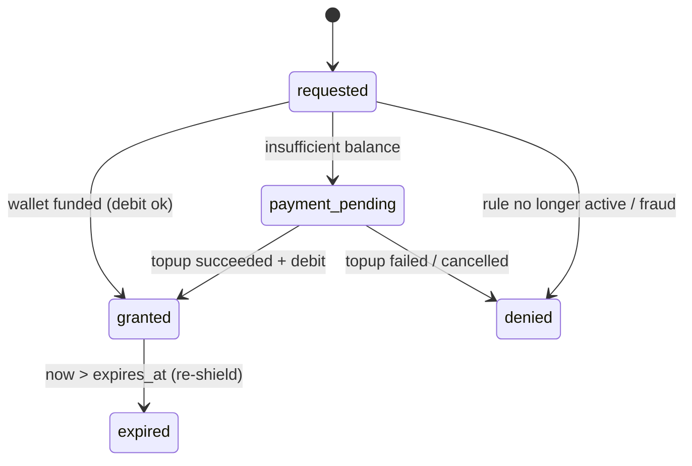

# Phase 3 — REST API Specification
### Commitment-Based Digital Discipline App ("Stake")

Consistent with the Phase 2 schema (NestJS + PostgreSQL, wallet-substrate-with-deposit-lock, isolated
double-entry ledger). See [openapi.yaml](openapi.yaml) for the machine-readable contract and
[security-framework.md](security-framework.md) for clock/root/webhook defenses.

## A. API Conventions (apply to every endpoint)

| Concern | Convention |
|---|---|
| Base URL / version | `https://api.stakeapp.io/v1` — version in path |
| Transport | TLS 1.3 only; HSTS; cert pinning (leaf+intermediate, backup pin) |
| Auth | Short-lived **access JWT** (10 min, `Authorization: Bearer`) + rotating **refresh token** (hashed in `core.sessions`) |
| Device binding | `X-Device-Id` (UUID) + `X-Device-Attestation`; tokens bound to a device |
| Idempotency | Money-moving/state-mutating POSTs require `Idempotency-Key` (UUIDv4), stored (`payments.idempotency_key`) |
| Request signing | Anti-tamper/sync/unlock endpoints require `X-Signature` + `X-Timestamp` + `X-Nonce` (HMAC, §G) |
| Errors | RFC-9457 Problem Details JSON; stable machine `code` |
| Time | Server is the **only** authority; device time is reported, never trusted |
| Rate limits | Per-user + per-device Redis token buckets; `429` + `Retry-After` |

**Standard error envelope:**
```json
{
  "type": "https://api.stakeapp.io/errors/limit-increase-requires-payment",
  "code": "RULE_INCREASE_FORBIDDEN",
  "title": "Screen-time limit cannot be increased without a commitment-break fee",
  "status": 409,
  "detail": "Increasing Instagram from 1800s to 2700s requires a commitment-break fee of NPR 50.00.",
  "instance": "/v1/screen-time-rules/0c2b…/limit",
  "meta": { "required_fee": { "amount": "50.0000", "currency": "NPR" } }
}
```

## B. Authentication
```
POST /v1/auth/register   → create user, send OTP/verify link
POST /v1/auth/login      → access+refresh tokens (device-bound)
POST /v1/auth/refresh    → rotate refresh, new access token
POST /v1/auth/logout     → revoke session
```
Refresh-token rotation mandatory: each `/refresh` issues a new refresh token and revokes the prior;
reuse of a revoked token → revoke the entire session family (theft detection).

## C. Device Registration & Anti-Tamper Heartbeat Sync

### C.1 Register / update device — `POST /v1/devices`
```json
{
  "os_platform": "android", "os_version": "15", "app_version": "1.4.2",
  "device_model": "Pixel 8", "hardware_id_hash": "b8e5…f01a",
  "push_token": "fcm:dQw4w9…", "push_provider": "fcm",
  "permissions": {
    "accessibility_granted": true, "usage_access_granted": true,
    "overlay_granted": true, "family_controls_granted": false, "battery_optimized": false
  },
  "attestation": { "type": "play_integrity", "token": "eyJ…<Play Integrity JWT>…" }
}
```
Response `201`:
```json
{
  "device_id": "5f3a2c10-9b1e-4a77-8d2c-1f0e9a7b6c54",
  "integrity_verified": true, "protection_status": "healthy",
  "heartbeat_interval_seconds": 60, "signing_key_id": "dk_2026_06_a",
  "server_time": "2026-06-12T04:21:00Z"
}
```

### C.2 Anti-tamper heartbeat — `POST /v1/devices/{device_id}/heartbeat`
Headers: `X-Signature, X-Timestamp, X-Nonce, X-Device-Attestation`
```json
{
  "seq": 88421,
  "device_local_time": "2026-06-12T09:53:31+05:45",
  "monotonic_uptime_ms": 184523910,
  "active_commitments": ["c_91a…", "c_77b…"],
  "permissions": { "accessibility_granted": true, "usage_access_granted": true,
    "overlay_granted": true, "family_controls_granted": false, "battery_optimized": false },
  "enforcement_state": { "shield_active_app_ids": ["ura_3f2…"], "last_block_at": "2026-06-12T09:40:12Z" },
  "integrity": { "root_detected": false, "hook_framework_detected": false,
    "clone_environment": false, "developer_mode": false },
  "attestation": { "type": "play_integrity", "token": "eyJ…" }
}
```
Response `200` (healthy):
```json
{
  "ack_seq": 88421, "server_time": "2026-06-12T04:08:31Z",
  "clock_skew_ms": 142, "clock_verdict": "ok",
  "protection_status": "healthy", "actions": [], "next_heartbeat_seconds": 60
}
```
Response `200` (tamper suspected):
```json
{
  "ack_seq": 88421, "server_time": "2026-06-12T04:08:31Z",
  "clock_skew_ms": 921344, "clock_verdict": "tamper_suspected",
  "protection_status": "degraded",
  "actions": [
    { "type": "RECORD_VIOLATION", "violation_type": "clock_tamper" },
    { "type": "SHOW_WARNING", "message": "Your device clock looks off. Commitments use server time." },
    { "type": "REQUIRE_REATTESTATION" }
  ],
  "grace": { "expires_at": "2026-06-12T04:38:31Z", "penalty_on_expiry": { "amount": "50.0000", "currency": "NPR" } },
  "next_heartbeat_seconds": 30
}
```
**Server-side processing:** verify signature/timestamp/nonce/attestation → persist `clock_skew_ms` →
clock-trust verdict → if permissions dropped / root / clone during an active commitment, enqueue a
`usage.violations` row + grace timer → a silence-sweeper flags devices that stop heartbeating during a
commitment (covers force-stop/uninstall) → same grace→penalty path.

## D. Usage Sync (batched, high-write) — `POST /v1/usage/sync`
Headers: `Idempotency-Key, X-Signature, X-Timestamp, X-Nonce`
```json
{
  "batch_id": "9c1e7f20-3a44-4b91-9c0e-77aa1234bcde",
  "device_id": "5f3a2c10-9b1e-4a77-8d2c-1f0e9a7b6c54",
  "events": [
    { "user_restricted_app_id": "ura_3f2c9a", "event_type": "foreground",
      "duration_seconds": 312, "device_local_ts": "2026-06-12T09:30:00+05:45", "monotonic_elapsed_ms": 184211900 },
    { "user_restricted_app_id": "ura_3f2c9a", "event_type": "threshold",
      "duration_seconds": 0, "device_local_ts": "2026-06-12T09:35:12+05:45", "monotonic_elapsed_ms": 184523000 }
  ]
}
```
Response `202`:
```json
{
  "batch_id": "9c1e7f20-3a44-4b91-9c0e-77aa1234bcde",
  "accepted_events": 2, "rejected_events": 0, "server_time": "2026-06-12T04:08:40Z",
  "rule_state": [
    { "user_restricted_app_id": "ura_3f2c9a", "current_usage_seconds": 1798,
      "daily_limit_seconds": 1800, "cooldown_state": "none", "limit_reached": false }
  ]
}
```
Raw rows go into partitioned `usage.usage_events`; async workers fold into counters/snapshots.
`monotonic_elapsed_ms` is the tamper-resistant elapsed-time source; `device_local_ts` is for display/forensics only.

## E. Unlock Request Flow (FR-2)

### E.1 Create — `POST /v1/unlock-requests`
Headers: `Idempotency-Key, X-Signature, X-Timestamp, X-Nonce`
```json
{ "user_restricted_app_id": "ura_3f2c9a", "device_id": "5f3a2c10-…", "duration_seconds": 300, "funding_source": "wallet" }
```
Response `200` (wallet funded → granted instantly):
```json
{
  "unlock_request_id": "ulr_7b2a91", "status": "granted",
  "user_restricted_app_id": "ura_3f2c9a", "duration_seconds": 300,
  "fee": { "amount": "50.0000", "currency": "NPR", "source": "wallet" },
  "granted_at": "2026-06-12T04:10:02Z", "expires_at": "2026-06-12T04:15:02Z",
  "authorization_token": "eyJhbGciOiJFZERTQSIsImtpZCI6ImRrXzIwMjZfMDZfYSJ9…",
  "wallet": { "available_balance": "430.0000", "locked_balance": "200.0000", "currency": "NPR" },
  "ledger_journal_id": "jrn_5c8e12"
}
```
The client passes `authorization_token` over the platform channel to the native module, which verifies
the EdDSA signature locally and lifts the shield until `expires_at`. Token is bound to
`device_id + user_restricted_app_id + exp`. Server work is one DB transaction: `SELECT … FOR UPDATE`
wallet → balanced journal (`user_available → forfeit_revenue`) → insert `unlock_requests(granted)` →
insert `violations(allowed_paid_unlock)`.

Response `402` (wallet empty → fund via gateway first):
```json
{
  "unlock_request_id": "ulr_7b2a91", "status": "payment_pending",
  "fee": { "amount": "50.0000", "currency": "NPR" },
  "funding_required": {
    "reason": "insufficient_wallet_balance", "available_balance": "10.0000",
    "shortfall": "40.0000", "topup_endpoint": "/v1/wallet/topup"
  }
}
```

### E.2 Native confirms applied — `POST /v1/unlock-requests/{id}/applied`
```json
{ "applied_at": "2026-06-12T04:10:03Z", "shield_lifted": true }
```

### E.3 Unlock state machine


## F. Wallet, Deposit, Rule-Edit & Removal

### F.1 Top-up — `POST /v1/wallet/topup` (Idempotency-Key)
```json
{ "amount": "500.0000", "currency": "NPR", "provider": "khalti", "return_url": "stakeapp://topup/return" }
```
Response `201`:
```json
{
  "payment_id": "pay_a91c33", "status": "pending", "provider": "khalti",
  "amount": "500.0000", "currency": "NPR", "provider_intent_id": "khalti_pidx_9aZ2",
  "checkout": { "type": "redirect", "url": "https://pay.khalti.com/?pidx=9aZ2" },
  "expires_at": "2026-06-12T04:40:00Z"
}
```
Wallet credited **only** when the verified webhook confirms success — never on client `return_url`.

### F.2 Create deposit — `POST /v1/commitment-deposits` (Idempotency-Key)
```json
{ "staked_amount": "1000.0000", "currency": "NPR", "commitment_end": "2026-07-12T00:00:00Z" }
```
Response `201`:
```json
{
  "deposit_id": "dep_4471aa", "status": "active", "staked_amount": "1000.0000", "currency": "NPR",
  "wallet": { "available_balance": "0.0000", "locked_balance": "1200.0000" },
  "ledger_journal_id": "jrn_77c2a1", "commitment_end": "2026-07-12T00:00:00Z"
}
```
Staking posts `user_available → user_locked`.

### F.3 Asymmetric rule edit — `PATCH /v1/screen-time-rules/{id}/limit` (Idempotency-Key)
- Decrease (free, immediate): `{ "daily_limit_seconds": 1200 }` → `200`.
- Increase (blocked): `{ "daily_limit_seconds": 2700 }` → `409 RULE_INCREASE_FORBIDDEN` with `required_fee`.
  Client first `POST /v1/commitment-breaks` (debits wallet, returns `break_token`), then retries the PATCH
  with `{ "daily_limit_seconds": 2700, "break_token": "brk_…" }`. Increase takes effect **next logical day**.

### F.4 Remove app — `DELETE /v1/user-restricted-apps/{id}` (Idempotency-Key)
Body: `{ "break_token": "brk_…" }`. Requires a paid commitment-break; removal effective **after the current
active window** (`removed_at` set, `status='removed'` deferred).

## G. Request Signing & Replay Protection
Per-device HMAC key (issued at registration, stored in Android Keystore / iOS Keychain — hardware-backed):
```
X-Timestamp: 2026-06-12T04:10:02Z
X-Nonce: 0f9a2c…   (128-bit random)
X-Signature: base64( HMAC-SHA256( deviceKey, METHOD + "\n" + PATH + "\n" + X-Timestamp + "\n" + X-Nonce + "\n" + sha256(body) ) )
```
Server rejects if: signature mismatch, `|server_now − X-Timestamp| > 120s`, or `X-Nonce` already seen
(Redis `SETNX`, TTL 300s). Stops replay of captured calls and binds the body to the signature.
