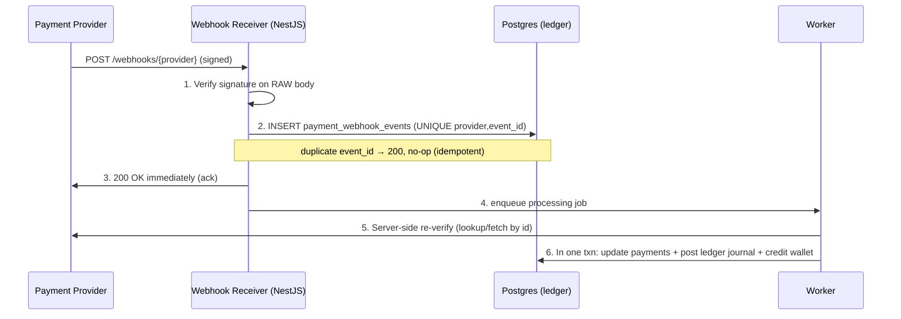

# Phase 3 — Security Framework
### Commitment-Based Digital Discipline App ("Bhaakal")

Covers device clock manipulation, rooted/jailbroken devices, payment webhook verification, and the
unlock-token verification spec. Companion to [rest-api-spec.md](rest-api-spec.md).

## H. Device Clock Manipulation

**Threat:** user rolls the device clock to escape a window or reset a daily limit.

1. **Server is the clock of record.** Window/limit/expiry decisions use `server_ts`. Unlock expiry is
   server-set and embedded in the signed token; the native module enforces it against
   `SystemClock.elapsedRealtime()` / `CLOCK_MONOTONIC`, not wall-clock.
2. **Monotonic elapsed time for durations.** Limit accumulation & unlock countdowns use
   `monotonic_elapsed_ms` (uptime-based) → clock edits cannot fast-forward/rewind.
3. **Skew detection & verdicts.** Each heartbeat computes `clock_skew_ms`. `ok` / `warn` /
   `tamper_suspected` (large jump, or skew direction change while uptime advanced normally) →
   `clock_tamper` violation + re-attestation + grace→penalty.
4. **Cross-check against trusted time** (attestation token timestamp; Play Integrity server-trusted
   timestamp; NTP divergence logged).
5. **Offline reconciliation** from `monotonic_elapsed_ms` deltas + trusted server-receipt time; gaps that
   don't add up flag tampering.

**Limitation:** offline, a user *can* desync local enforcement temporarily; contained by re-shielding on
reconnect, reconstructing the timeline from monotonic deltas, and treating discontinuities as
money-costing violations.

## I. Rooted / Jailbroken & Tampered-Client Detection

| Layer | Android | iOS |
|---|---|---|
| **Platform attestation (primary, server-verified)** | **Play Integrity API** — verify token server-side; `appRecognitionVerdict=PLAY_RECOGNIZED`, `deviceIntegrity` contains `MEETS_DEVICE_INTEGRITY`, package+cert digest match | **App Attest + DeviceCheck** — verify against Apple server-side; bind hardware key to install |
| **Local signals (advisory)** | root/`su`, Magisk, SELinux, hooking frameworks (Frida), debugger, emulator, runtime cert check | jailbreak paths, `fork()` success, suspicious dylibs, URL-scheme probes |
| **Clone/dual-app** | parallel-space data paths, unexpected package count, work-profile | limited; rely on category-shielding |
| **Behavioral** | heartbeat claims healthy but never reports blocks despite usage; impossible skew patterns | same |

**Policy:**
- **Attestation verified on the server**, gating `integrity_verified`. Local signals are inputs that raise
  risk, never the verdict (trivially spoofable on a rooted device).
- Device failing attestation during an **active commitment** → `degraded`, record violation, grace, then
  forfeit/penalize. New commitments cannot be created on an unattested device.
- **Never trust a self-reported "healthy."** Absence of valid attestation = not protected = commitment at risk.

**Limitation:** a fully rooted device can defeat *local* enforcement. The financial model survives because
money is captured up front and the server forfeits it on detected tamper/silence — the bypass succeeds
technically but **still costs the user**.

## J. Payment Webhook Verification

**Threat:** forged "payment succeeded" webhook credits a wallet for free; or replayed webhooks double-credit.



**Per-provider verification:**
| Provider | Method |
|---|---|
| **Stripe** | `Stripe-Signature` → HMAC-SHA256 of `timestamp.rawBody` with webhook secret; reject if tolerance > 5 min or mismatch; then `paymentIntents.retrieve(id)` to confirm `succeeded` + amount/currency match |
| **eSewa** | Verify response signature/HMAC against secret, then call status-check by `transaction_uuid`; assert `status=COMPLETE` + amount match. Never trust browser `return_url` params |
| **Khalti** | Server-side `lookup` by `pidx` → assert `status='Completed'` + amount match |
| **Fonepay** | Validate DV/verification hash over agreed field concatenation; reconcile via verification API by PRN |

**Hard rules:**
1. **Verify on the raw, unparsed body** — JSON re-serialization breaks HMAC. Capture raw body for `/webhooks/*` before body-parsing.
2. **Signature first, then dedupe** via `payment_webhook_events (provider, provider_event_id)` UNIQUE.
3. **Amount + currency + intent-id must match** the pre-created `payments` row; mismatches rejected + alerted.
4. **Crediting is server-pull-confirmed**, not webhook-pushed: worker re-fetches authoritative status before posting the ledger journal.
5. **Idempotent ledger posting:** credit journal keyed to `payment_id` → no double-credit.
6. **Webhook endpoints** are unauthenticated by JWT but authenticated by signature, IP-allowlisted, separately rate-limited.

## Unlock Token Verification (shared spec)

Server mints an **Ed25519-signed JWT** (`authorization_token`). Native verifies it **offline** before lifting a block.

**Claims:**
```json
{
  "ulr": "ulr_7b2a91", "ura": "ura_3f2c9a", "dev": "5f3a2c10-…",
  "dur": 300, "iat": 1778630000, "exp": 1778630300, "kid": "dk_2026_06_a"
}
```

**Verification (Android, Tink/Conscrypt Ed25519):**
```kotlin
object TokenVerifier {
    fun verify(token: String, expectedUra: String, deviceId: String): UnlockGrant? {
        val (header, payload, sig) = split(token)
        val key = KeyStore.publicKeyFor(header.kid) ?: return null          // pinned server keys
        if (!Ed25519.verify(key, "$header.$payload".toByteArray(), sig)) return null
        val c = parse(payload)
        if (c.dev != deviceId || c.ura != expectedUra) return null          // binding
        if (serverWallClockNow() > c.exp + SKEW_TOLERANCE) return null      // soft wall sanity gate
        val anchorElapsed = MonotonicClock.now()                            // AUTHORITATIVE expiry
        return UnlockGrant(ura = c.ura, expiresElapsed = anchorElapsed + c.dur * 1000L)
    }
}
```

**Clock-enforcement subtlety:** the JWT `exp` is wall-clock (user could fast-forward past / rewind), so the
module does **not** enforce `exp` against the wall clock for the countdown. At acceptance it **anchors to
`elapsedRealtime()`** and computes `expiresElapsed = now + dur`; the block re-asserts the instant
`elapsedRealtime() >= expiresElapsed`. The wall-clock `exp` is only a coarse "absurdly stale" gate. **Server
public keys are pinned** (rotated via `kid`). iOS uses the same logic with CryptoKit `Curve25519.Signing`,
anchoring to `mach_absolute_time` inside the ShieldAction extension.

## K. Consolidated Threat Model

| Threat | Primary control | Residual handling |
|---|---|---|
| Replay of an unlock-grant call | Request signing + nonce + timestamp window | Token device+app+exp bound, single-window |
| Forged payment webhook | Raw-body signature + server-side re-verify + amount match | Unknown-intent webhooks rejected/alerted |
| Double-credit (provider retry) | UNIQUE event-id inbox + idempotent journal | No-op on replay |
| Clock rollback | Server-authoritative time + monotonic durations + skew verdicts | Tamper → violation → grace → forfeit |
| Rooted device spoofing health | Server-verified Play Integrity / App Attest | Money pre-captured → forfeited on tamper |
| Force-stop / uninstall mid-commitment | Heartbeat silence sweeper + grace timer | Forfeit locked deposit / debit wallet |
| Stolen access token used elsewhere | Device-bound JWT + per-device HMAC key in hardware keystore | Refresh-reuse → revoke session family |
| Tampered request body (MITM) | TLS 1.3 + cert pinning + body hash in signature | Mismatch → reject |
| Client grants itself a free unlock | Server-authoritative state; signed token only server can mint | Native verifies server's EdDSA signature |

**Through-line:** the device is **hostile and untrusted**; the server is the sole authority for time,
balances, rule state, and unlock grants; and because money is **captured up front**, even a technically
successful bypass results in a **financial consequence the server applies unilaterally**.
