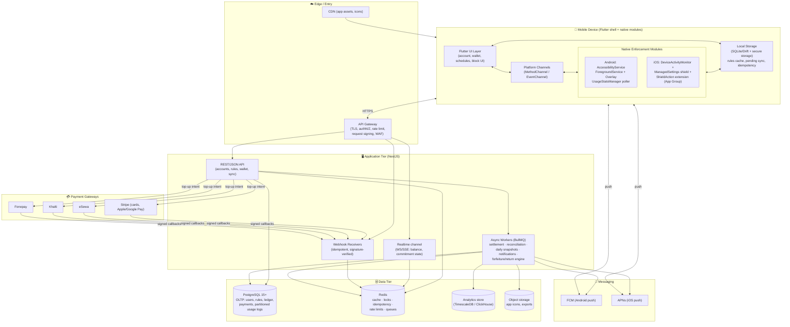

# Phase 2 — Technology Stack & System Design
### Commitment-Based Digital Discipline App ("Stake")

## 1. Mobile Framework — Flutter vs. React Native

The enforcement layer is **almost entirely native platform-channel work** (Accessibility/UsageStats/
foreground-service on Android; DeviceActivity/ManagedSettings/extensions on iOS). The cross-platform
framework mostly *hosts* UI + account/wallet logic; the hard parts are native either way.

| Dimension | Flutter | React Native |
|---|---|---|
| Native bridge | Platform Channels (MethodChannel/EventChannel) — clean streaming of native events | TurboModules/JSI — fast, but JS runtime is the bridge's reason to exist |
| **Background reality** | The Accessibility/Foreground service & iOS extensions run as **pure native** code; framework often *not even loaded* | Same — RN headless JS background is more fragile and doesn't help with OS-driven extensions |
| iOS extension lifecycle | Extensions are separate processes; neither framework runs inside them — Swift + App Groups shared container | Same; RN inside an extension is impractical |
| Always-resident process | AOT single-engine → predictable memory under battery-optimizer pressure | JS bridge + Hermes adds a runtime to keep alive |
| Block UI | Renders own pixels → identical controllable UI (but real block surface is native anyway) | Native components (block surfaces native regardless) |

**Definitive recommendation: Flutter.** The genuinely hard code is native in both, so RN's JS ecosystem
advantage doesn't apply to the enforcement core; Flutter's AOT single-engine model is more predictable as
an always-resident process; EventChannel streaming fits pushing native foreground/threshold events.

> **Architecture note:** treat enforcement as **two native modules** (`android/` Kotlin, `ios/` Swift +
> extensions) behind a thin Dart facade. ~60–70% of the *risk* lives in native code on each platform.

## 2. Backend — Laravel vs. Node (Express/Fastify) vs. NestJS

Workload: high-frequency device sync, **critical payment webhooks** (idempotent, ordered, auditable),
real-time-ish analytics, **state-machine-heavy financial ledger**.

| Dimension | Laravel | Express/Fastify | **NestJS** |
|---|---|---|---|
| Concurrency for sync/webhook bursts | PHP-FPM, heavier under fan-in | Excellent event loop | Excellent event loop |
| Structure for ledger/state machines | MVC, can sprawl | **Unopinionated** → risky for payments | **Opinionated modular DI** → clean bounded contexts |
| Type safety (money) | Weaker | Optional TS | **First-class TypeScript** |
| Queues/jobs | Horizon (mature) | BullMQ | BullMQ + Nest lifecycle |
| Webhook idempotency | Doable | Manual | DI + interceptors make it straightforward |
| Shared language with Flutter | No | TS-ish | **TS** — single typed contract surface |

**Definitive recommendation: NestJS (TypeScript)** — structured, testable, type-safe foundation for a
money-moving, state-machine-heavy backend on Node's strong event-loop concurrency, with BullMQ for
settlement/reconciliation/snapshot jobs.

**Database engine: PostgreSQL** — ACID + strong transactional guarantees for the ledger; `SELECT … FOR
UPDATE` row locks; `NUMERIC` exact money; partial/expression indexes; native partitioning for high-write
usage logs; JSONB for flexible payloads; rich constraints.

**Supporting stores:** **Redis** (cache, rate limits, idempotency keys, distributed locks, BullMQ queues)
and an optional **time-series/analytics** path (TimescaleDB on the same Postgres, or ClickHouse later).

## 3. System Architecture Diagram

## Summary of definitive recommendations
| Decision | Recommendation |
|---|---|
| Payment model | Hybrid wallet substrate + commitment-deposit lock |
| Local top-up rails | eSewa / Khalti / Fonepay; **Stripe** global + Apple/Google Pay |
| Mobile framework | **Flutter** (native enforcement in Kotlin/Swift behind Dart facade) |
| Backend | **NestJS (TypeScript)** + BullMQ workers |
| Primary DB | **PostgreSQL 15+** (+ Redis; TimescaleDB/ClickHouse later) |
| Ledger | Isolated `ledger` schema, append-only double-entry, journal-atomic, role-restricted |

See [database/schema.md](../database/schema.md) for the full DDL.
