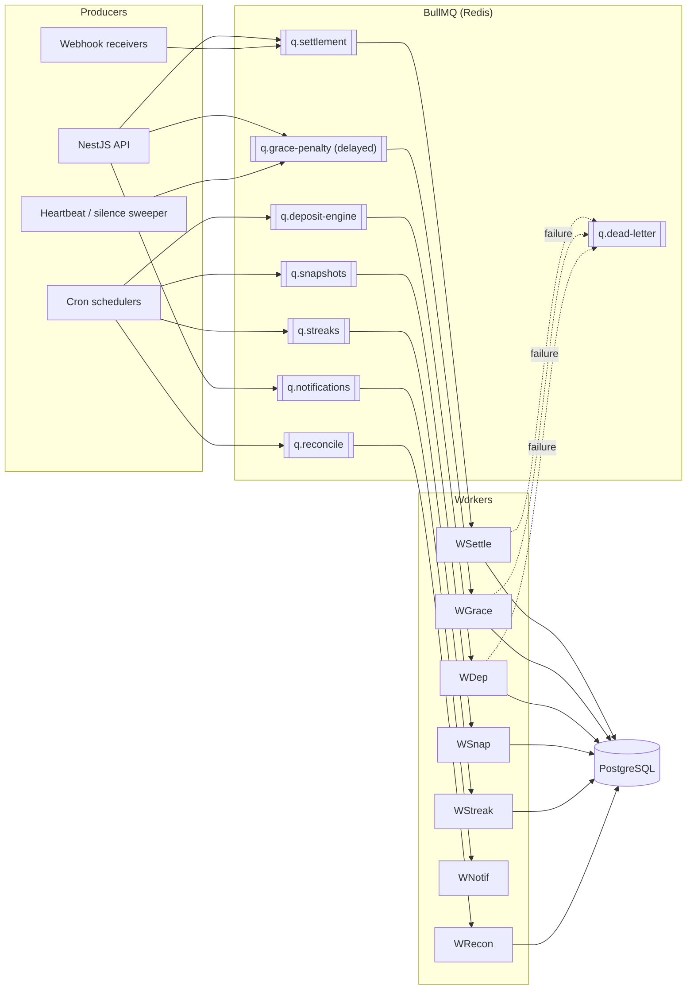
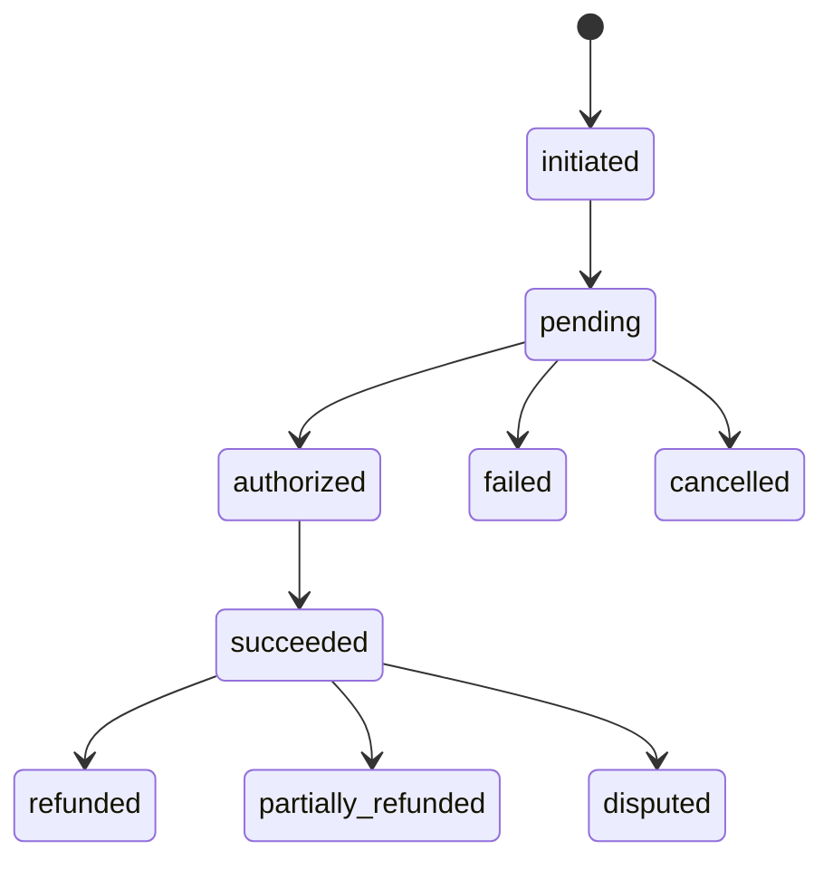
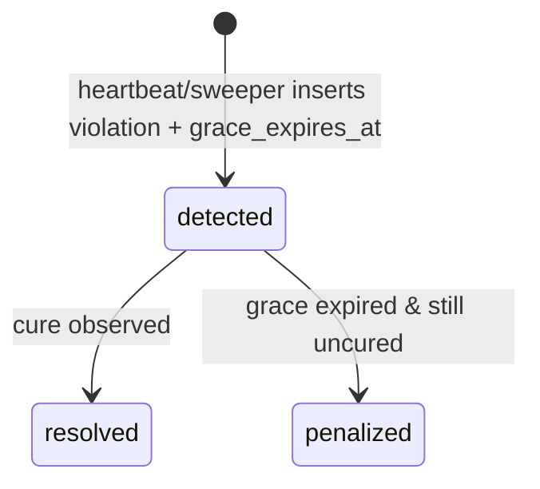
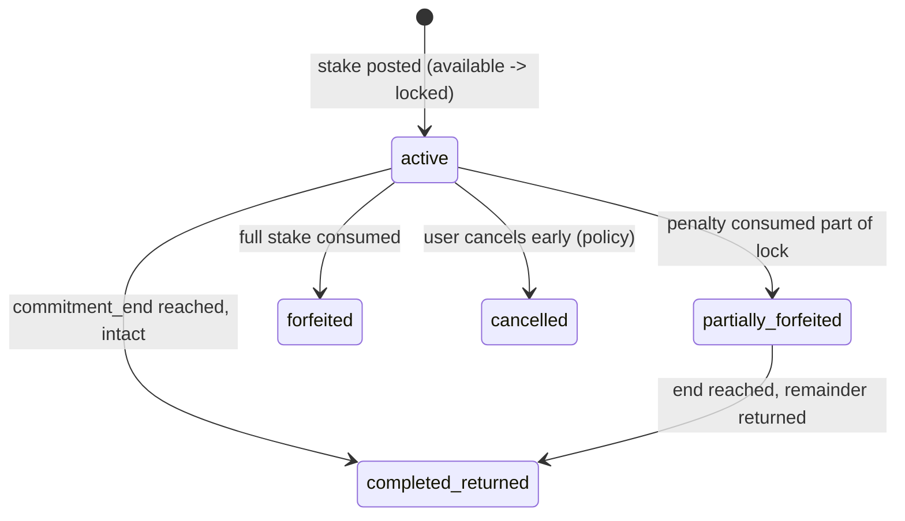
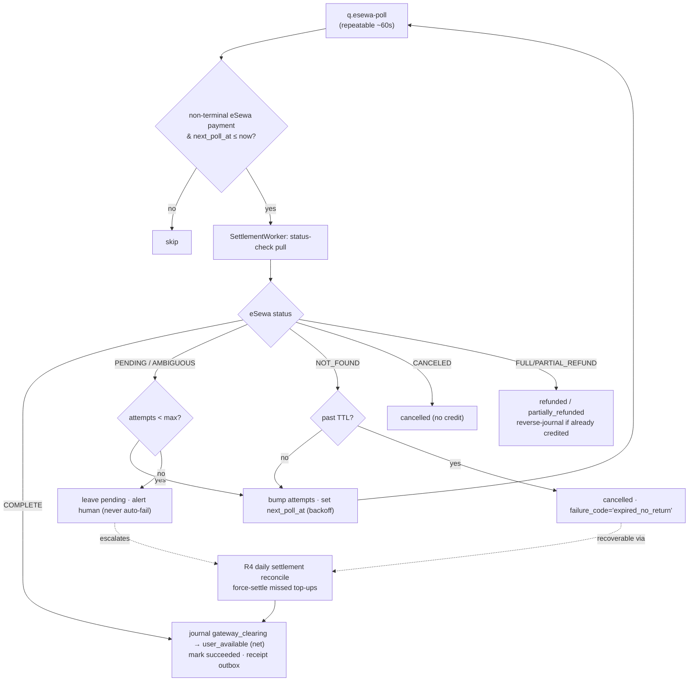
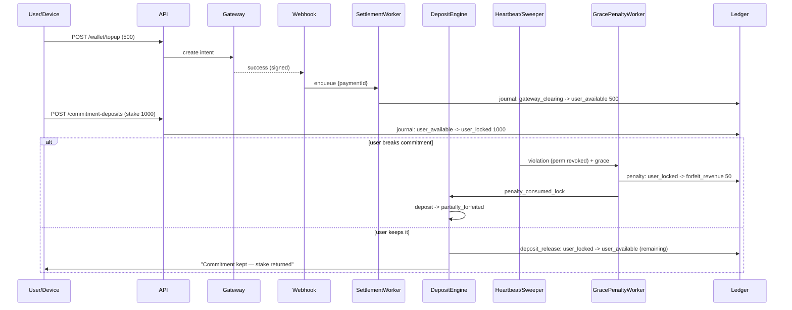

# Phase 4c — Ledger & State-Machine Worker Specifications
### Commitment-Based Digital Discipline App ("Stake")

Server-side engine converting violations, silence, clock tamper, paid unlocks, and top-ups into
**correct, idempotent, auditable money movements**. NestJS + BullMQ + PostgreSQL against the Phase 2 schema.

**Non-negotiable property:** every money movement is a balanced, append-only double-entry journal posted
**exactly once**, even under retries, crashes, and duplicate events.

## 1. Worker Topology



**Cross-cutting rules:**
- **Single writer per wallet** — `pg_advisory_xact_lock(hashtext(wallet_id))` inside the txn serializes debits/credits.
- **Idempotent by construction** — stable `idempotency_key`; the posting primitive refuses a second journal for the same `(reference_type, reference_id)`.
- **Transactional outbox** — side effects written in the same DB txn as the ledger post, dispatched by a relay.
- **Retries → DLQ** — exponential backoff (5 attempts); terminal failures page an operator.

## 2. The Posting Primitive (every worker calls this)

Account map & balance convention:
| Account | Type | Balance = | Role |
|---|---|---|---|
| `user_available` | liability | credits − debits | spendable wallet |
| `user_locked` | liability | credits − debits | staked/locked deposit |
| `user_payout_pending` | liability | credits − debits | withdrawal held pending disbursement |
| `system_gateway_clearing` | asset | debits − credits | funds in transit at PSP |
| `system_forfeit_revenue` | revenue | credits − debits | forfeits/penalties → company |
| `system_charity` | liability | credits − debits | forfeits earmarked for charity |
| `system_fees` | expense | debits − credits | gateway fees |

Journal templates (all net to zero):
| Event | Debit | Credit |
|---|---|---|
| Top-up (net) | `system_gateway_clearing` | `user_available` |
| Gateway fee | `system_fees` | `system_gateway_clearing` |
| Stake a deposit | `user_available` | `user_locked` |
| Paid unlock (from available) | `user_available` | `system_forfeit_revenue` |
| Penalty (locked first, then available) | `user_locked` / `user_available` | `system_forfeit_revenue` *(or `system_charity`)* |
| Deposit forfeiture | `user_locked` | `system_forfeit_revenue` *(or `system_charity`)* |
| Deposit return | `user_locked` | `user_available` |
| Withdrawal — request hold | `user_available` | `user_payout_pending` |
| Withdrawal — paid (disbursed) | `user_payout_pending` | `system_gateway_clearing` |
| Withdrawal — release (reject/fail/cancel) | `user_payout_pending` | `user_available` |

```ts
// The only code allowed to write ledger.*  — runs inside one DB transaction.
async postJournal(tx, input) {
  // 1. Idempotency
  const existing = await tx.query(
    `SELECT id FROM ledger.journals WHERE reference_type=$1 AND reference_id=$2`,
    [input.referenceType, input.referenceId]);
  if (existing.rows.length) return { journalId: existing.rows[0].id };   // no-op replay
  // 2. Balance invariant
  const debit = sum(debits(input.legs)), credit = sum(credits(input.legs));
  if (!debit.eq(credit) || debit.lte(0)) throw new UnbalancedJournalError();
  // 3. Serialize per wallet
  for (const w of affectedWalletIds(input.legs))
    await tx.query(`SELECT pg_advisory_xact_lock(hashtext($1))`, [w]);
  // 4. Sufficiency (no negative wallet)
  await assertNoOverdraw(tx, input.legs);
  // 5. Append journal + entries (immutable)
  const journalId = await insertJournal(tx, input);
  for (const leg of input.legs) {
    const balanceAfter = await applyToLedgerAccount(tx, leg);
    await insertEntry(tx, journalId, leg, balanceAfter);
  }
  // 6. Refresh wallet cache (ledger remains source of truth)
  await refreshWalletCache(tx, input.legs);
  return { journalId };
}
```

## 3. Settlement Worker (`q.settlement`)
Turns a verified gateway webhook into wallet credit — exactly once.
```ts
async process({ paymentId }) {
  await db.tx(async tx => {
    const p = await lockPaymentRow(tx, paymentId);             // FOR UPDATE
    if (TERMINAL.has(p.status)) return;                        // already settled
    const live = await providers[p.provider].fetchStatus(p.provider_intent_id); // server PULL
    assertMatch(live, { amount: p.amount, currency: p.currency });
    if (live.status !== 'succeeded') { await markPayment(tx, p, 'failed', live); return; }
    if (p.purpose === 'wallet_topup') {
      await ledger.postJournal(tx, {
        referenceType: 'payment', referenceId: p.id, currency: p.currency,
        description: `Top-up ${p.amount} via ${p.provider}`,
        legs: [
          { accountId: acc.gatewayClearing(p.currency), direction: 'debit',  amount: p.netAmount },
          { accountId: acc.userAvailable(p.userId, p.currency), direction: 'credit', amount: p.netAmount },
        ] });
      if (p.fee_amount.gt(0)) await postFeeJournal(tx, p);
    }
    await markPayment(tx, p, 'succeeded', live);
    await outbox(tx, 'notification', { type: 'payment_receipt', userId: p.userId, paymentId: p.id });
    if (p.continuation) await outbox(tx, p.continuation.queue, p.continuation.payload);
  });
}
```
**Payment state machine:**

Illegal transitions (e.g. `succeeded → pending`) rejected by a guard table; out-of-order webhooks can only advance.

## 4. Grace → Penalty Engine (`q.grace-penalty`)
Detection opens a grace window; the penalty is only posted if the user doesn't cure it (avoids penalizing innocent OEM battery-kills).

Scheduling: on violation insert, enqueue a **delayed** job with `delay = grace_expires_at − now`, `jobId = violation:{id}`.
```ts
async process({ violationId }) {
  await db.tx(async tx => {
    const v = await lockViolation(tx, violationId);
    if (v.enforcement_action !== 'grace_period') return;
    if (await isCured(tx, v)) {
      await setViolation(tx, v, { enforcement_action: 'warning', resolved_at: now() });
      await outbox(tx, 'notification', { type: 'protection_down', userId: v.user_id,
        body: 'Protection restored — no penalty applied.' }); return;
    }
    const fee = penaltyPolicy.amountFor(v.violation_type, v.user_id);
    const dest = forfeitPolicy.destination(v.user_id);
    const legs = await buildDebitLegs(tx, v.user_id, fee, dest);     // locked-first waterfall
    const { journalId } = await ledger.postJournal(tx, {
      referenceType: 'penalty', referenceId: v.id, currency: fee.currency,
      description: `Penalty: ${v.violation_type}`, legs });
    await setViolation(tx, v, { enforcement_action: 'penalty_applied',
      fee_applied: fee.amount, related_journal_id: journalId });
    await outbox(tx, 'deposit-engine', { type: 'penalty_consumed_lock', userId: v.user_id,
      amount: fee.amount, journalId });
    await outbox(tx, 'notification', { type: 'commitment_break', userId: v.user_id,
      body: `Commitment broken — ${fee.amount} ${fee.currency} forfeited.` });
  });
}
```
**Insufficient funds:** post what's available, record a `negative_commitment_balance` flag, block new
commitments + require top-up. Wallet never goes negative. Mitigated by **capping max penalty exposure to the
pre-funded balance** at commitment-creation time — enforced by the **minimum-funding-to-create-a-commitment**
rule (PRD FR-6 / `payments/payment-architecture.md`): a commitment can't be armed unless available balance ≥
the minimum backing, so there is always money behind the teeth.

## 5. Deposit Forfeiture / Return Engine (`q.deposit-engine`)

- `penalty_consumed_lock`: decrement effective remaining lock, bump `forfeited_amount`, set status. No new journal (penalty journal already moved the money).
- `commitment_end` reached (cron `jobId = deposit:{id}:return`): return remaining locked:
```ts
await ledger.postJournal(tx, {
  referenceType: 'deposit_release', referenceId: deposit.id, currency: deposit.currency,
  description: 'Commitment kept — return remaining stake',
  legs: [
    { accountId: acc.userLocked(deposit.user_id, c), direction: 'debit',  amount: remaining },
    { accountId: acc.userAvailable(deposit.user_id, c), direction: 'credit', amount: remaining },
  ] });
```
`CHECK (forfeited_amount + returned_amount <= staked_amount)` makes over-return/over-forfeit impossible.
Returned money lands in **available balance** (not auto-refunded to card); explicit withdrawal separately.

## 6. Reconciliation Workers (`q.reconcile`, nightly)
| Check | Verifies | On mismatch |
|---|---|---|
| **R1 — Journal balance** | every journal nets to zero | page; freeze writes |
| **R2 — Wallet cache vs ledger** | recompute available/locked from entries vs cache | repair from ledger; alert delta |
| **R3 — Global double-entry** | total debits == credits; assets = liabilities + revenue ± fees | page |
| **R4 — Provider settlement** | succeeded payments vs provider settlement export | ops ticket |
| **R5 — Payout settlement** | `paid` withdrawals vs bank / connectIPS settlement export (both ways) | page; **freeze payouts** |
Plus orphan scans: granted unlocks w/o journal; active deposits past end w/o release; payments stuck pending past TTL → expire.

**Payout safety (outbound = unrecoverable real money):** a withdrawal stuck in `processing` is resolved
**only** by checking the bank / connectIPS status — **never blind-retried**. Each withdrawal carries an
idempotent disburse reference (connectIPS merchant txn ref) so a batch re-run cannot double-pay. R5 flags
any `paid` withdrawal missing from the bank export (did it actually send?) and any bank debit lacking a
`paid` withdrawal. See `payments/payment-architecture.md` → "Withdrawal / payout flow".

## 6b. eSewa Top-up Reconciliation — "paid but didn't return"

eSewa ePay v2 has **no async webhook**: confirmation rides the browser redirect to `success_url`.
If the user approves payment then closes the browser before the redirect fires, the `payments` row
is stranded at `initiated`/`pending` while the money has already left their eSewa account. Because we
set `transaction_uuid = payment.id` at initiation, we can always ask eSewa "what happened to attempt
X?" via the status-check API keyed on `(product_code, total_amount, transaction_uuid)` — **no callback
required**. Reconciliation = poll until terminal, then converge local state toward eSewa.

> The same `q.esewa-poll` mechanism serves the other redirect/QR gateways via their own
> `fetchStatus`: **Khalti** = `epayment/lookup/` by `pidx`; **Fonepay** = status-check by PRN (and for
> Fonepay **QR**, which has no redirect at all, this poller is the *primary* confirmation path, not a
> fallback). See `payments/payment-architecture.md` → "Khalti & Fonepay — deltas".

**Guiding rule:** eSewa is the source of truth about whether money moved; local state is a cache we
reconcile toward it. **Never move a payment to a terminal *unpaid* state from silence alone** — only an
explicit eSewa `CANCELED`/`NOT_FOUND` (after TTL) or the settlement report may declare "not paid." A
stranded `pending` with no eSewa answer stays `pending` and escalates to a human; it is never auto-failed.

**Status poller (`q.esewa-poll`, repeatable ~60s)** sweeps non-terminal eSewa payments and hands each
to the existing **SettlementWorker** (reuse `fetchStatus` + journal posting — no parallel credit path):
```sql
SELECT p.id FROM billing.payments p
JOIN billing.payment_poll_state s ON s.payment_id = p.id
WHERE p.status IN ('initiated','pending','authorized')
  AND p.provider = 'esewa' AND s.next_poll_at <= now()
ORDER BY s.next_poll_at LIMIT 200;        -- bounded batch; cap concurrency to stay polite
```

**Sidecar poll state** (keeps the hot `payments` row out of poll-churn / lock contention with settlement):
```sql
CREATE TABLE billing.payment_poll_state (
  payment_id     UUID PRIMARY KEY REFERENCES billing.payments(id),
  attempts       INT NOT NULL DEFAULT 0,
  last_polled_at TIMESTAMPTZ,
  next_poll_at   TIMESTAMPTZ NOT NULL,   -- seeded to initiated_at + 30s
  last_status    VARCHAR(32)
);
```
**Backoff schedule:** `+30s, +1m, +2m, +5m, +10m, +20m, +30m`, then stop live polling and hand to R4.
The +30s head start lets the happy-path redirect win, so most top-ups are never polled at all.

**eSewa `status` → action:**
| `status` | Action |
|---|---|
| `COMPLETE` | **Settle:** journal `gateway_clearing → user_available` (net); mark `succeeded` |
| `PENDING` / `AMBIGUOUS` | keep polling (backoff); alert if `AMBIGUOUS` persists past max attempts |
| `NOT_FOUND` | keep polling until TTL → then `cancelled` + `failure_code='expired_no_return'` |
| `CANCELED` | `cancelled` (terminal, no credit) |
| `FULL_REFUND` / `PARTIAL_REFUND` | `refunded` / `partially_refunded`; reverse-journal if already credited |

`assertMatch(live, {amount,currency})` stays — an amount mismatch is tamper/fraud → `failed` + page, never credit.

**The redirect-vs-poller race is already safe** via the §8 exactly-once layers: `jobId=settle:{paymentId}`
dedups enqueues, the `FOR UPDATE` + `TERMINAL.has(status)` guard no-ops the loser, and journal dedup on
`(reference_type='payment', reference_id)` makes a double-credit impossible. A late redirect after the
poller settled is a non-event.

**R4 is the financial backstop:** the daily settlement-report reconcile (§6) **force-settles** any
eSewa-settled `transaction_uuid` lacking a `succeeded` payment locally (the ultimate fix for premature
expiry), and pages on any local `succeeded` absent from eSewa's export. Layers above are just for fast UX.



## 7. Aggregation, Streaks, Notifications
- **SnapshotWorker** (per user at their `day_boundary_minutes`): folds `usage_events` into `daily_snapshots` + `daily_app_usage`. Idempotent on `(user_id, snapshot_date)`. **Rule rollover:** at the boundary it also resets `current_usage_seconds`/`current_day_key` and **applies any staged increase** (`pending_limit_seconds` → `daily_limit_seconds` when `pending_effective_day_key` ≤ new day), then clears the pending fields — this is where the FR-4 *next-logical-day* increase lands.
- **StreakWorker**: updates `gamification_state` (streaks, productivity score, money saved). Replayable from snapshots.
- **NotificationWorker**: the outbox relay; reads pending `engage.notifications`, sends via FCM/APNs, advances status. Idempotent on notification id.

## 8. Exactly-Once — five stacked layers
1. **Inbound dedup:** webhook `(provider, provider_event_id)` UNIQUE.
2. **Job dedup:** BullMQ `jobId = {type}:{entityId}`.
3. **Journal dedup:** `ledger.journals (reference_type, reference_id)` lookup → no-op on replay.
4. **Serialization:** advisory lock + `FOR UPDATE` per wallet.
5. **Atomic side effects:** ledger post + state transition + outbox commit in one txn; relay dispatches after commit.

## 9. Failure / Retry / Ops
| Failure | Behavior |
|---|---|
| Transient DB/Redis | retry w/ backoff; idempotent |
| Provider fetch timeout | leave pending; retry; expire after TTL |
| Unbalanced journal / overdraw | throw → rollback → DLQ + page |
| Penalty insufficient funds | partial + `negative_commitment_balance` flag |
| Worker crash mid-job | txn rolls back; re-deliver; no-op if committed |
| Reconciliation drift (R1/R3) | **freeze money writes**, page |

**Observability:** queue depth/lag, DLQ size (alert > 0), reconciliation deltas (alert ≠ 0), ledger
global-balance gauge, time-to-settle histogram. DLQ non-empty and any reconciliation delta are **paging** events.

## 10. End-to-End Lifecycle

