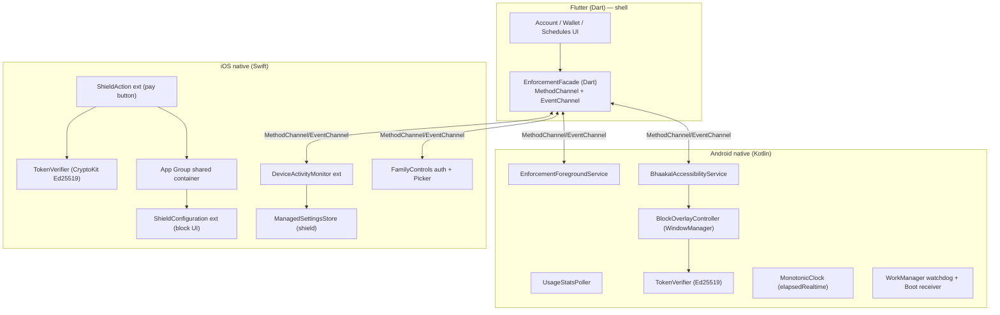
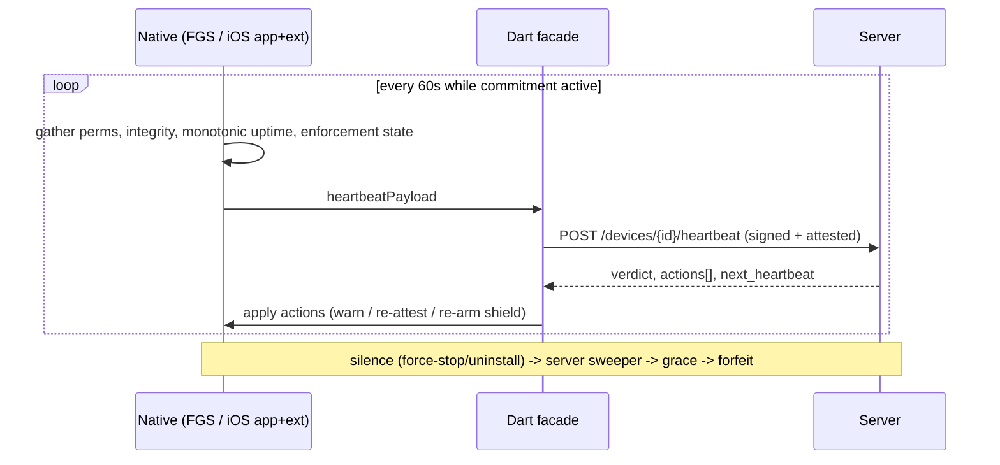

# Phase 4b — Native Enforcement Module Design
### Commitment-Based Digital Discipline App ("Bhaakal")

> 🎯 **Scope: Android-only.** Only the **Android (Kotlin)** module is in active scope. All **iOS** content
> here (DeviceActivity / ManagedSettings / ShieldAction extensions, App Group, App Attest, pre-auth
> unlocks) is **deferred reference** for the future fast-follow — do not build it now.

**Design invariant:** the device is hostile and untrusted. The native module is an *executor of
server-authorized decisions*, never an authority. It can verify a server signature and enforce an expiry
against a monotonic clock — it cannot mint a grant, set a balance, or be trusted to "self-report healthy."

## 1. Module Boundary & Shared Facade



The Dart facade is thin: `configureRules(rules)`, `requestPermissions()`, `applyUnlock(token)`,
`getProtectionStatus()`, and an event stream of `{foregroundApp, blockShown, limitReached,
permissionChanged}`. **The iOS extensions do not run inside the Flutter engine** — separate processes that
talk to the app only via the App Group container.

## 2. Android Enforcement Module

| Component | Role |
|---|---|
| `EnforcementForegroundService` | Owner process; persistent notification; rule cache; coordinates poller+overlay; emits heartbeats. `START_STICKY`. |
| `BhaakalAccessibilityService` | Primary foreground-app detector via `TYPE_WINDOW_STATE_CHANGED`; fastest path to the block screen. |
| `UsageStatsPoller` | Secondary detector + authoritative usage time via `UsageStatsManager.queryEvents`; fallback if Accessibility denied. |
| `BlockOverlayController` | Block screen via `WindowManager` `TYPE_APPLICATION_OVERLAY`; Cancel / Pay tiers. |
| `TokenVerifier` | Verifies server Ed25519 token locally before lifting a block. |
| `MonotonicClock` | `SystemClock.elapsedRealtime()` for unlock expiry + limit accrual. |
| Watchdog | `WorkManager` periodic + `BootReceiver` + `AlarmManager` exact → restart on FGS death. |

**Foreground detection → block decision:**
```kotlin
class BhaakalAccessibilityService : AccessibilityService() {
    override fun onAccessibilityEvent(event: AccessibilityEvent) {
        if (event.eventType != AccessibilityEvent.TYPE_WINDOW_STATE_CHANGED) return
        val pkg = event.packageName?.toString() ?: return
        if (pkg == packageName || pkg in IGNORED_SYSTEM_PKGS) return
        when (val d = RuleEngine.evaluate(pkg, MonotonicClock.now())) {
            is Decision.Block      -> Overlay.show(pkg, d.reason, d.unlockTiers)
            is Decision.AllowUntil -> Overlay.dismissIfFor(pkg)
            Decision.Allow         -> Overlay.dismissIfFor(pkg)
        }
    }
    override fun onInterrupt() {}
}
```
`RuleEngine.evaluate` is pure/local, reading cached rules + any valid unlock token's expiry (checked vs
`elapsedRealtime`). No network on the hot path — block must appear <300 ms. **Cancel** routes to Home
(`GLOBAL_ACTION_HOME`); the overlay re-asserts on every window-state change still resolving to a blocked package.

**Daily limit accrual:** FGS accumulates per-app foreground seconds using `elapsedRealtime` deltas (not wall
clock), buffers, batch-syncs via `POST /v1/usage/sync`; server reconciles and pushes authoritative
`current_usage_seconds`. Clock changes can't inflate/deflate accrued time.

**Persistence against OEM battery killers (the real Android battle):**
1. Foreground service + ongoing notification (typed on Android 14+).
2. `WorkManager` periodic watchdog (15 min) + `AlarmManager.setExactAndAllowWhileIdle` heartbeat to restart a dead FGS.
3. `BootReceiver` + `ACTION_MY_PACKAGE_REPLACED` to resurrect after reboot/update.
4. Onboarding deep-links to disable battery optimization / autostart; detect `battery_optimized=true` and surface as a risk.
5. **Server silence-sweeper** treats unexplained gaps during a commitment as a violation → grace → penalty. Even when the OS kills us, **the financial consequence still lands.**

**Anti-uninstall (honest):** `DeviceAdminReceiver` adds friction (uninstall requires deactivating admin
first) — deterrent only. Real enforcement = pre-captured funds + forfeit-on-silence. Surfaced honestly in onboarding.

## 3. iOS Enforcement Module

iOS inverts the model: the OS detects and shields; we configure policy and react in extensions. Three
targets + the app, sharing an App Group container.

| Target | Role |
|---|---|
| Main app | Requests FamilyControls auth; `FamilyActivityPicker` → stores opaque `ApplicationToken`s; writes rule config + valid unlock tokens to App Group; schedules `DeviceActivity` monitoring. |
| DeviceActivityMonitor ext | OS calls `intervalDidStart/End` (windows) + `eventDidReachThreshold` (limits); applies/removes the shield via `ManagedSettingsStore`. |
| ShieldConfiguration ext | Renders the custom block screen (limited UI). |
| ShieldAction ext | Handles taps on shield buttons — "pay to unlock" initiation. |

**Authorization + scheduling:**
```swift
try await AuthorizationCenter.shared.requestAuthorization(for: .individual)
// FamilyActivityPicker(selection: $selection) ; SharedStore.write(selection)
let schedule = DeviceActivitySchedule(
    intervalStart: DateComponents(hour: 9, minute: 0),
    intervalEnd:   DateComponents(hour: 17, minute: 0), repeats: true)
let event = DeviceActivityEvent(applications: selection.applicationTokens,
                                threshold: DateComponents(minute: 30))
try DeviceActivityCenter().startMonitoring(.init("restriction.window.1"),
    during: schedule, events: [ .init("limit.instagram"): event ])
```

**Applying the shield (monitor extension):**
```swift
final class BhaakalMonitor: DeviceActivityMonitor {
    private let store = ManagedSettingsStore(named: .init("stake.main"))
    override func intervalDidStart(for a: DeviceActivityName) {
        let sel = SharedStore.readSelection()
        store.shield.applications = sel.applicationTokens
        store.shield.applicationCategories = .specific(sel.categoryTokens)
    }
    override func intervalDidEnd(for a: DeviceActivityName) {
        if !SharedStore.anyActiveWindow() { store.shield.applications = [] }
    }
    override func eventDidReachThreshold(_ e: DeviceActivityEvent.Name, activity: DeviceActivityName) {
        store.shield.applications = SharedStore.tokens(for: e); SharedStore.markLimitReached(e)
    }
}
```

**Pay button (ShieldAction):** extensions **cannot present a payment sheet**. The "pay to unlock" flow on
iOS is best done as **pre-authorized unlocks**: the user buys unlock credit/time *in the app* (cooperative,
gateway-friendly — fits the wallet model), and the `ShieldAction` extension *verifies and consumes* a token
already in the App Group. Fallback: `.defer` + a push notification "open Bhaakal to unlock."
```swift
final class BhaakalShieldAction: ShieldActionDelegate {
    override func handle(action: ShieldAction, for app: ApplicationToken,
                         completionHandler: @escaping (ShieldActionResponse) -> Void) {
        switch action {
        case .primaryButtonPressed:
            if let t = SharedStore.validUnlockToken(for: app),
               TokenVerifier.verify(t, app: app, now: MonotonicClock.now()) {
                ManagedSettingsStore(named: .init("stake.main")).shield.applications?.remove(app)
                SharedStore.consume(t); completionHandler(.none)
            } else { SharedStore.recordUnlockIntent(app); completionHandler(.defer) }
        case .secondaryButtonPressed: completionHandler(.close)
        @unknown default: completionHandler(.close)
        }
    }
}
```

**iOS clock & limitations:** no monotonic foreground polling — accrual is the OS's `DeviceActivityEvent`
threshold. Schedule windows are wall-clock based; server owns commitment truth; app re-syncs/re-arms on
launch and push wake. Tokens are opaque — analytics are coarser by design.

## 4. Unlock Token Verification & Clock Enforcement
See [../api/security-framework.md](../api/security-framework.md) — Ed25519-signed JWT, claims bound to
`dev`+`ura`+`exp`, pinned server public keys (rotated by `kid`), and the **monotonic-anchored expiry** (JWT
`exp` not enforced against wall clock; at acceptance anchor `expiresElapsed = elapsedRealtime() + dur`).

## 5. Heartbeat & Reconciliation

- **Android** emits from the FGS; watchdog covers death.
- **iOS** piggybacks on app foreground, silent push wake, BGAppRefreshTask, and extension invocations writing "last seen" to the App Group. Sparser → server grace thresholds tuned per-platform.
- On reconnect, native re-arms enforcement from server-authoritative rule state.

## 6. Permissions Onboarding
- **Android (sequential, verified after each step):** Usage Access → Accessibility (Play-compliant
  justification) → Overlay → disable battery optimization → (optional) Device Admin → Notifications (13+).
- **iOS:** FamilyControls authorization (single prompt) → FamilyActivityPicker → Notifications. Gated on
  Apple having **granted the Family Controls distribution entitlement**.

## 7. Testing Matrix
| Scenario | Android | iOS |
|---|---|---|
| Block <300 ms on blocked-app launch | Accessibility+overlay timing on low-end+flagship | Shield latency (OS) |
| OEM battery-kill survival | Xiaomi/Oppo/Vivo/Samsung/Pixel matrix | n/a |
| Clock rollback during unlock | Monotonic deadline holds | Re-arm on launch |
| Reboot mid-commitment | BootReceiver re-arms | startMonitoring persists |
| Force-stop then reopen | Watchdog restart + silence reported | n/a |
| Token replay / cross-device | Rejected | Rejected in ShieldAction |
| Rooted/jailbroken | Attestation fails server-side → penalty | App Attest fails → penalty |
| Pre-purchased unlock consumed once | Single-use enforced | App Group consume once |
