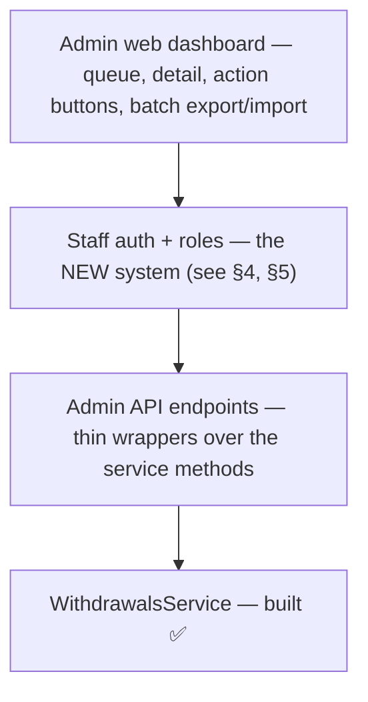
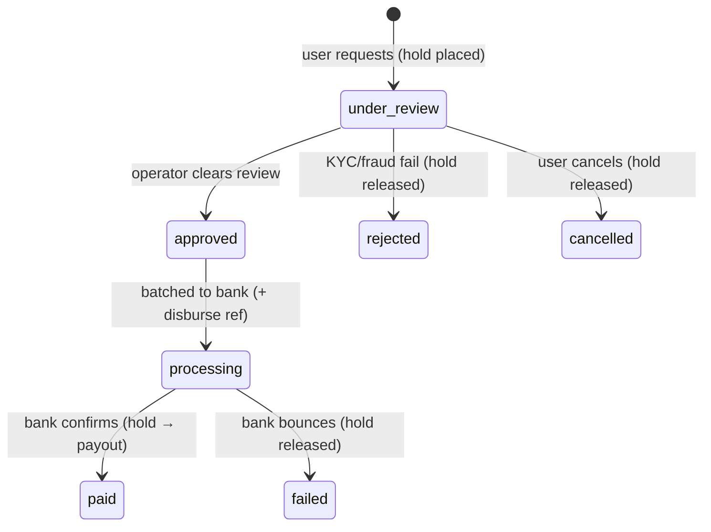

# Admin Console & Manual Payout Operations
### Commitment-Based Digital Discipline App ("Bhaakal")

> 🗓️ **Status: FUTURE / deferred — not in the first launch.** Withdrawals ship in a
> post-launch update ([delivery plan](../project/delivery-plan.md)). This document is the
> **agreed design** for the operator-facing tooling that manual payouts require; nothing
> here is built yet. The *money* side (ledger, withdrawal state machine) already exists —
> see "What already exists" below.

Theme: **a payout console can move real money, so it is the highest-value internal target in
the system** — it is designed front-to-back around *least privilege*, *separation of the
powerful from the routine*, and *everything audited*.

---

## 1. Why this exists

The withdrawal/payout rail is **manual batch bank transfer** at launch scale (🔒 locked —
see [payment-architecture.md](../payments/payment-architecture.md) "Withdrawal / payout flow").
"Manual" means a human operator reviews each request, sends the money via the bank, and
confirms settlement. That human needs **controls to act on** (the *admin surface*) and a
**procedure to follow** (the *ops runbook*). This document specifies both, plus the
**staff authentication** they depend on — which the system does **not** have today (every
account is a normal app user; there is no staff login).

## 2. What already exists (backend, built)

The money mechanics are done; only the operator layer is missing.

- `WithdrawalsService` — a two-phase state machine with the ledger safety baked in:
  `under_review → approved → processing → paid`; `rejected / failed / cancelled` release the
  hold back to spendable balance.
- Guards on request: **KYC-gated** (bank account name must match the KYC-verified name),
  **step-up OTP**, **24 h anti-cycling** cooling-off on fresh top-ups, **tiered daily caps**,
  **min Rs 500**, flat **Rs 10 gross-down** fee, **idempotent `disburse_reference`**.
- **Two-phase hold** — funds move `user_available → user_payout_pending` (unspendable) the
  instant a request is made; only a confirmed `paid` converts the hold to an actual payout.
- **R5 payout reconciliation** (ledger-workers §6) matches `paid` rows against the bank export.

The ops transition methods (`approve`, `markProcessing`, `markPaid`, `reject`, `markFailed`)
**exist but have no way to be invoked** — no admin endpoint, no UI. That is the gap this design fills.

> 🔒 **Client entry is gated OFF until payouts ship.** Because the request path
> *is* live (a completed withdrawal locks the user's balance in `user_payout_pending`
> with nothing to fulfil it), the mobile **"Withdraw" + "Payout history"** entries are
> hidden behind `FeatureFlags.withdrawalsEnabled = false` (stake-mobile). Flip that
> flag when this ops surface + real KYC land.

## 3. Admin surface — a web dashboard on a general console shell

**🔒 Decision: build a staff web dashboard** (not a CLI or shared-key API), structured as a
**general "admin console" shell** with **withdrawals as the first module**, so it can later
absorb KYC review, user support, metrics, etc. without a rebuild.

The layers are built bottom-up; each is a superset of the cheaper options, so nothing is wasted:

**Hosting / exposure:** the dashboard is **not publicly reachable** — behind a VPN or IP
allowlist, on a **separate subdomain**, and **never bundled into the user app**.

## 4. Staff authentication — email + password + TOTP 2FA

**🔒 Decision.** Staff auth is **completely separate** from the phone-OTP *user* login.

- **Isolated table** `admin.staff_users` (never `core.users`) — email, `password_hash`,
  `totp_secret`, `role`, `status`, `created_by`, `last_login_at`. A breach or bug in one
  auth system must never touch the other.
- **Password:** argon2id + strong policy + login **rate-limit / lockout**.
- **2FA = TOTP** (authenticator app) + **backup codes**. Chosen over SMS/email 2FA: no cost,
  no deliverability risk, self-contained.
- **Session:** a **separate, short-lived** admin token; an `AdminAuthGuard` + role check gates
  every admin endpoint; **step-up re-auth** (re-enter password or TOTP) on the money-moving
  actions (mark paid / mark failed).
- **Provisioning is invite-only** — **no public sign-up**. An existing admin creates staff
  accounts; the **first** account is created by a one-off **seed / CLI script** (also the
  break-glass path).
- **Recovery is admin-initiated only — no self-service** password or 2FA reset (a self-service
  reset email/flow is a classic account-takeover vector, far worse for a money-moving account).
  This is why **≥ 2 superadmins** are mandatory (see §5): they reset each other.

## 5. Roles — superadmin + admin

Two axes are deliberately kept distinct: **administrative power** (managing staff) vs
**operational duties** (doing payouts).

| Capability | **superadmin** | **admin** |
|---|:---:|:---:|
| Manage staff (create/disable, assign roles) | ✅ | ❌ |
| Reset another staff member's password / 2FA | ✅ | ❌ |
| System / config settings | ✅ | ❌ |
| Review / approve / reject withdrawals | ✅ | ✅ |
| Mark processing / paid / failed | ✅ | ✅ |
| View users / KYC | ✅ | ✅ |

**🔒 Decisions:**
- **superadmin = admin + staff management** — superadmins **also run day-to-day payouts** (the
  "former" option; simplest for a small team). Rare (**≥ 2**, founders); the highest-value target.
- **admin** — runs payouts and views users/KYC; **cannot** manage staff.
- **Least privilege** — most staff are plain admins; superadmin is not handed out "just in case."
- **No one is above the audit log** — every superadmin action (role change, account create,
  2FA reset) is itself an audited, sensitive event. Role changes are **superadmin-only**.
- The `role` field is **extensible**: a future **separation-of-duties** split (e.g. a
  *reviewer* who approves vs a *finance* role who marks paid, so no single insider pushes a
  payout end-to-end) can be added **without a rebuild**. Not shipped at launch volume.

## 6. Security posture (summary)

- Dashboard behind VPN / IP allowlist, separate subdomain, never in the user app.
- Short-lived admin sessions; **step-up** on pay/fail actions.
- **Every action audited** with the staff identity — the built `reviewed_by` column on
  `billing.withdrawals` is already waiting for this.
- ≥ 2 superadmins; invite-only provisioning; admin-initiated recovery only.

## 7. Withdrawal ops runbook (the operator procedure)

The dashboard exists to drive this loop against the built state machine:

### 7.1 Cadence & SLA 🔒

- **Frequency:** the operator runs the loop **every Nepal business day** (Sun–Fri; banks are
  **closed Saturday**, and Sunday **is** a working day).
- **Cutoff — 12:00 noon NPT:** requests in **before** noon are processed that day; **after**
  noon they roll to the next business day. Noon (not later) leaves margin to *initiate*
  transfers before Friday's ~3 PM bank close; it's a config value, tune to taste.
- **User promise (SLA): paid within 1–3 Nepal business days** — this is the
  `estimated_completion` shown in-app. Deliberately conservative so bank **settlement lag** and
  **holiday clusters** stay *inside* the promise (under-promise, over-deliver). The `paid`
  confirmation is often **T+1** — the bank's settlement export typically lands the next business day.
- **Weekend / holidays:** Saturday and public holidays are **not** business days; a request made
  then starts the clock on the next business day. During multi-day closures (Dashain / Tihar),
  the operator posts an **in-app notice** and the SLA is understood in *business* days.
- **Continuity:** because payouts run daily, a **backup operator** (the second superadmin/admin
  required by the ≥ 2 rule, §5) covers when the primary is away. A single missed day is absorbed
  by the 1–3 day buffer.
- **Cancellation window:** a user may cancel while `under_review` — in practice, until the next cutoff.

### 7.2 Procedure

1. **Review** — pull the `under_review` queue. Per request: verify the KYC name matches the
   bank account name, check fraud/velocity flags, sanity-check bank details. → **Approve** or
   **Reject** (with a note).
2. **Batch** — export the `approved` rows to a CSV for the bank portal.
3. **Disburse** — upload the batch to the bank; mark each row **processing** with the bank's
   reference number.
4. **Confirm** — download the bank's confirmation export; reconcile against `processing` rows:
   cleared → **mark paid**; bounced → **mark failed** (hold auto-releases). Investigate any
   mismatch via the **R5** reconciliation report.

> ⚠️ **A stuck `processing` is never blind-retried** — it is resolved only by checking the
> bank, because a disbursement is unrecoverable real money. The idempotent `disburse_reference`
> makes a batch re-run safe.

## 8. Open items (still to decide)

- **Two-person approval** threshold (if/when the reviewer-vs-finance split is adopted).
- **Legal constraints** — Nepal e-money / KYC review (day-1 launch blocker) may dictate *who*
  may hold funds, payout SLA, and record-keeping more than product preference does.
- Extra fraud rules beyond those already coded (e.g. a manual hold on a user's *first* payout).

---

**Related:** [payment-architecture.md](../payments/payment-architecture.md) (withdrawal money
flow, payout rail strategy) · [backend/ledger-workers.md](../backend/ledger-workers.md) (R5
reconciliation) · [ops/sre-plan.md](sre-plan.md) · [api/security-framework.md](../api/security-framework.md).
