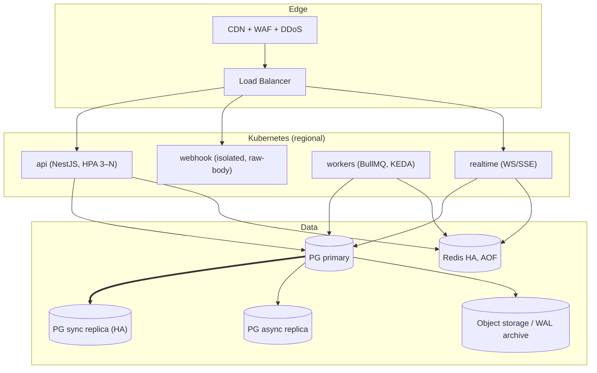

# Operations & SRE Plan
### Commitment-Based Digital Discipline App ("Bhaakal")

Theme: **the ledger is sacred** (any imbalance freezes writes and pages a human) and **the device is
untrusted** (server-held funds are the backstop).

## 1. Environment & Deployment Topology

- **Environments:** `dev` → `sandbox` → `prod`, fully isolated (DB, Redis, secrets). No shared state.
- **Webhooks separate** — raw-body parsing, distinct rate-limit/IP-allowlist, stays available during API rollouts (a dropped payment webhook is money).
- **Region:** primary near the user base; DB/ledger single-writer in one region; multi-region **active-passive**. Never shard/multi-master the ledger.

## 2. Scaling the High-Write Path
- **Partition automation (pg_partman/cron):** pre-create next month ~7 days ahead (alert if missing); detach + archive partitions > ~90 days to object storage.
- **Index discipline on hot partitions:** only the two Phase 2 indexes; route dashboards to the async replica.
- **Tactics:** batch + async ingestion (`202`, aggregation in BullMQ); PgBouncer transaction-mode pools (separate API vs worker pools); **KEDA scales workers on queue depth** with money lanes (`q.settlement`, `q.grace-penalty`) prioritized.

## 3. Database HA, Backup & PITR
| Control | Spec |
|---|---|
| HA | sync replica in 2nd AZ; auto failover (Patroni/managed); `synchronous_commit=on` for ledger/billing txns |
| WAL archiving | continuous → object storage; **PITR to any second**; RPO ≤ 5 s money data |
| Base backups | daily full + WAL; 35 days hot; ledger retained per tax law (5–7 yr) |
| Restore drills | **quarterly** PITR into isolated env + run R1–R4 reconciliation |
| Ledger immutability | append-only trigger + role grants; app role `INSERT`-only; break-glass DBA role MFA+audited |
| RTO | ≤ 15 min DB failover; ≤ 2 h regional DR rebuild |

## 4. Redis & Queue Ops
- AOF (`appendfsync everysec`) + HA so queued money jobs survive node loss (at-least-once safe via idempotency).
- Separate instances/DBs for queues vs idempotency/nonce vs cache.
- Nonce TTL = signature window (300 s).
- **DLQ depth > 0 = page.** SLIs: depth, oldest-job age, processing rate. Alert `q.settlement` oldest-job age > 60 s.

## 5. Cryptographic Key Management
- **Ed25519 unlock-signing keys** (`kid = dk_YYYY_MM_x`): private key in KMS/HSM; public keys pinned in native clients; **monthly rotation** with current+next overlap; tokens carry `kid`. Compromise runbook: revoke kid, force client update, shorten TTLs; tokens also device+monotonic bound → contained, Sev-1.
- **Per-device HMAC keys + attestation:** hardware-backed storage; attestation roots in KMS; verification server-side.
- **Secrets:** in a secrets manager (Vault/KMS), runtime-injected, never in git; provider webhook secrets rotated with overlap.
- **TLS cert pinning:** leaf + backup pin; rotate backup pin one release *before* the cert.

## 6. Observability
| Signal | Tooling | Money specifics |
|---|---|---|
| Metrics | Prometheus + Grafana | ledger global-balance gauge; queue depth/lag; settlement time-to-credit; reconciliation deltas; payment success per provider; heartbeat-silence count |
| Logs | Structured JSON | never log PANs/full tokens/secrets; log `payment_id`, `journal_id`, `idempotency_key` |
| Traces | OpenTelemetry | trace unlock path + settlement path end-to-end |
| Audit | Append-only audit log | every money transition, break-glass access, key rotation |

**Paging alerts:** reconciliation drift (auto-freezes writes); DLQ > 0; settlement error rate / oldest-job age; provider success-rate drop; attestation failure spike; heartbeat-silence spike.

## 7. SLOs
| Service | SLI | SLO |
|---|---|---|
| Auth/API availability | success rate | 99.9% / 30 d |
| Unlock grant latency | p99 (wallet path) | < 800 ms |
| Block enforcement (client) | block shown after detect | p95 < 300 ms |
| Webhook ingestion | 2xx ack rate | 99.95% |
| Settlement freshness | verified webhook → credit | p95 < 30 s |
| **Ledger correctness** | reconciliation drift events | **0 (no error budget)** |

## 8. Incident Runbooks
**8.1 Reconciliation Freeze (most important):** auto `MONEY_WRITES_FROZEN=true` (money workers pause; API
rejects money mutations with `503`; enforcement/read paths stay up) → page on-call + finance → diagnose from
the immutable ledger (R2 recompute) → **never edit `ledger.entries`; correct via a compensating journal
(`reference_type='correction'`), two-engineer review** → re-run R1–R3 clean → unfreeze → drain → post-mortem.

**8.2 Payment Provider Outage:** mark provider `degraded`; route new top-ups to a healthy provider; queue
reconciliation for the down provider; pending payments auto-expire. Already-funded users keep unlocking (wallet path unaffected).

**8.3 Mass Enforcement Outage (bad release):** heartbeat-silence spike after a release → **pause grace→penalty
conversions** (`PENALTY_CONVERSION_PAUSED`); roll back; resume only after devices re-arm. **Never penalize on our own outage.**

**8.4 Signing-Key Compromise:** revoke kid, force client update, shorten TTLs, rotate. Sev-1.

**8.5 Data-Subject Request:** export from replica; deletion anonymizes PII but **retains financial ledger records** (legal), de-linking PII while preserving the immutable money trail.

## 9. CI/CD & Migrations
- Pipeline: lint (incl. Spectral on OpenAPI) → tests → **contract diff (OpenAPI vs DTOs)** → ephemeral-env e2e incl. **ledger reconciliation test** → security scan → deploy.
- **Zero-downtime migrations:** expand → backfill → contract across releases. **Forbidden:** `DROP`/`ALTER` on `ledger.entries`/`journals` (guard blocks anyway). New money columns additive; throttled backfills.
- **Release strategy:** API rolling; **canary staged rollout for the mobile client** with auto-halt on heartbeat-silence spike.
- **Feature flags as ops levers:** `MONEY_WRITES_FROZEN`, `PENALTY_CONVERSION_PAUSED`, per-provider `enabled`, attestation strictness.

## 10. Security, Compliance & Data Governance
| Area | Posture |
|---|---|
| PCI scope | card data never touches servers (Stripe Elements/SDK + redirects) → **SAQ-A**; store only references/tokens |
| PII | encrypt at rest + backups; TLS 1.3; field-level encryption for contacts; minimize (iOS opaque tokens) |
| Data residency | confirm Nepali residency; pin primary region + in-region WAL |
| Stored value / e-money | wallet holds user funds → financial regulation, escrow/segregated accounts, KYC; **legal review is a launch blocker** |
| Retention | ledger 5–7 yr; telemetry short hot window + aggregate-then-purge |
| Access control | least privilege; break-glass MFA + audited; app role can't mutate ledger |
| Edge | WAF (OWASP), per-user/device rate limits, DDoS, webhook IP-allowlist |

## 11. Capacity & Cost
- Dominant write cost: `usage_events` → batch size, partition granularity, archival.
- Dominant compute: workers under load (KEDA on queue depth, money lanes prioritized).
- **Fee guardrail:** Nepali per-txn fees on Rs.50 are brutal → wallet batches top-ups; monitor fee-as-%-of-volume; nudge minimum top-up sizes.

## 12. DR Summary
| Scenario | RTO | RPO | Mechanism |
|---|---|---|---|
| AZ loss | < 15 min | ~0 | sync replica failover |
| Primary DB corruption | < 2 h | ≤ 5 s | PITR + reconciliation before reopening writes |
| Region loss | < 4 h | ≤ 1 min | WAL/backups in 2nd region; active-passive rebuild |
| Redis loss | < 5 min | ≤ 1 s | HA failover; idempotent replay |
| Provider outage | 0 (degraded) | n/a | provider re-routing; wallet path unaffected |

**Golden rule:** after any restore/failover, **run R1–R3 reconciliation before re-enabling money writes.**
