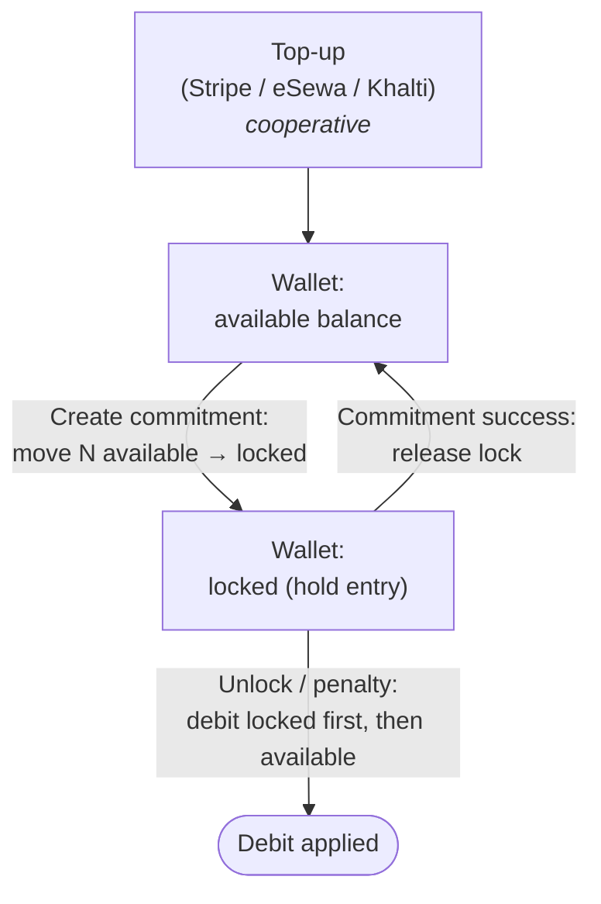
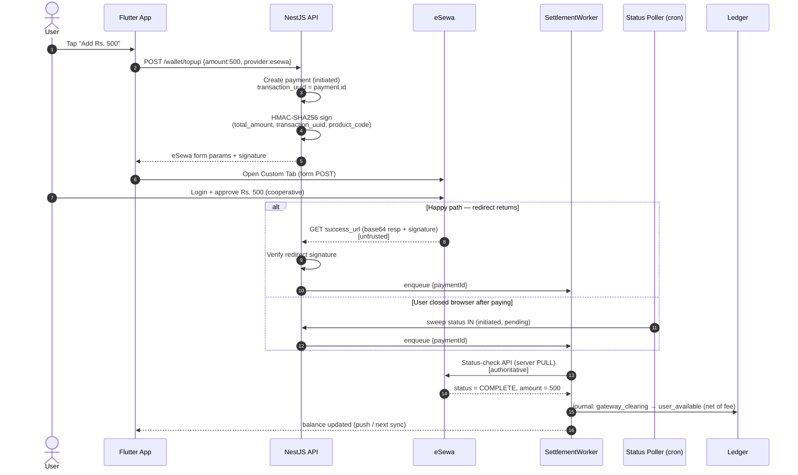
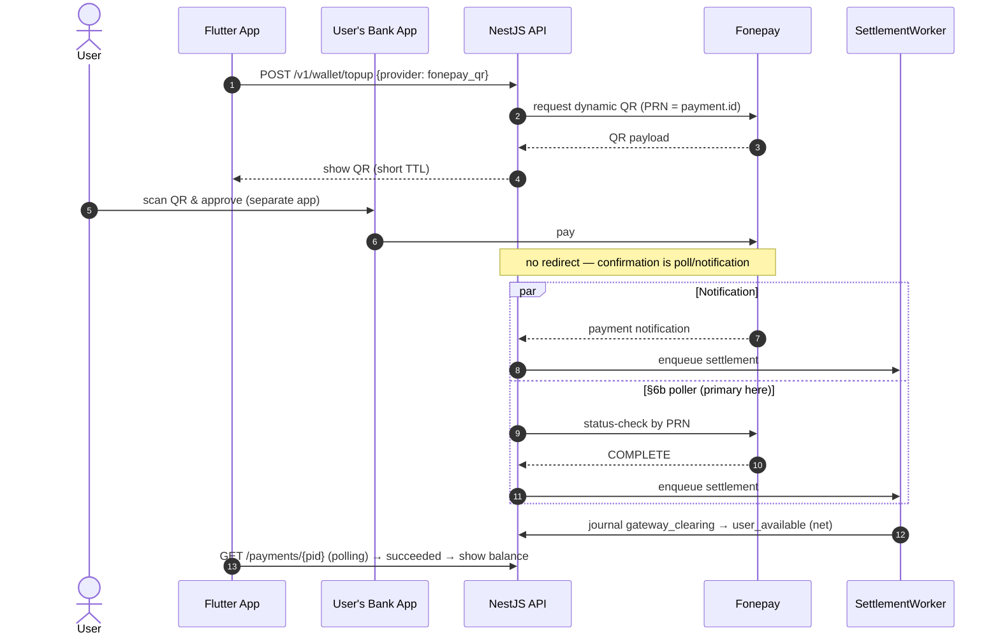
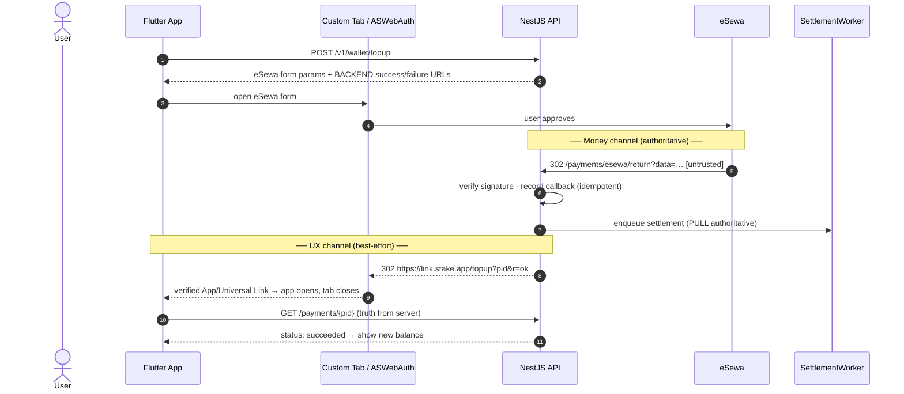
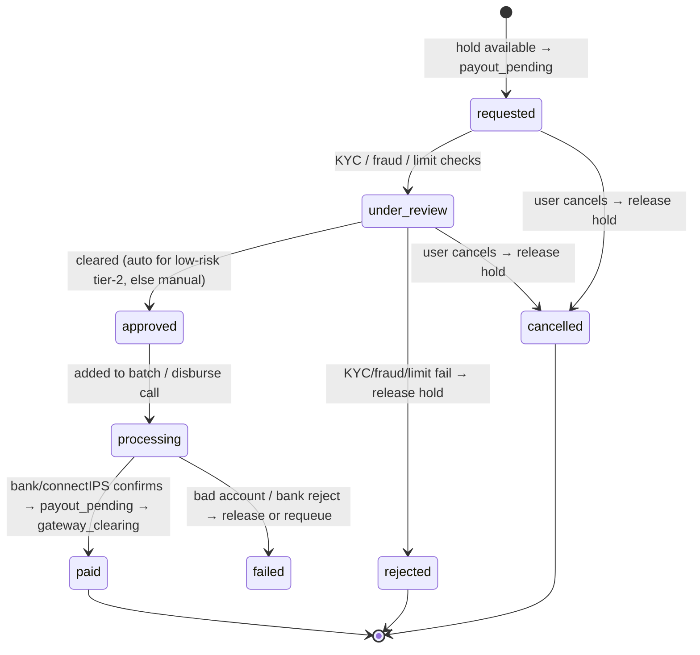
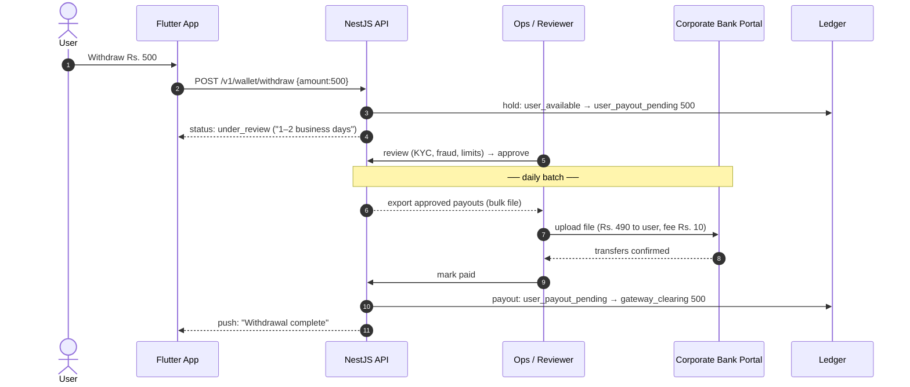

# Phase 2 — Payment System & Architecture Analysis
### Commitment-Based Digital Discipline App ("Stake")

## Provider landscape & what it forces on the design

| Provider | Type | Integration reality | Off-session charge? |
|---|---|---|---|
| **eSewa** (Nepal) | Wallet/redirect | Redirect + signed callback (HMAC). No card vaulting. | ❌ |
| **Khalti** (Nepal) | Wallet/redirect + KPG | Redirect/SDK + server verification (`lookup`/verify). | ❌ |
| **Fonepay** (Nepal) | QR / inter-bank | QR + webhook. | ❌ |
| **Stripe** (Global) | Card/processor | PaymentIntents, **SetupIntents + off-session charging**, Connect for payouts. | ✅ |
| **Apple Pay / Google Pay** | Wallet front-ends | Ride on Stripe as a payment method; store-policy nuance for digital goods. | ✅ via Stripe (on-session) |

**Decisive fact:** the Nepali providers are **redirect-and-approve only**. None let you silently
charge a saved instrument. This **kills any model that charges the user *at the moment they cheat***
in the local market — at that moment the user is hostile and won't complete a redirect.
**Capture money *before* the violation, while the user is cooperative.**

## The three patterns

### Option A — Immediate payment per violation/unlock
- **Pros:** no stored value; no pre-commitment friction; 1:1 event mapping.
- **Cons (severe):** every enforcement moment = full redirect/3DS round-trip → **abysmal success rate**; **impossible for penalties** (can't charge after revoke/uninstall); broken-feeling latency; tiny Rs.50 charges are margin-negative.
- **Verdict:** ❌ Disqualified as primary.

### Option B — Wallet (preload, auto-deduct)
- **Pros:** enforcement is a **local ledger debit** → instant, works offline-then-sync, **works for penalties after revoke/uninstall**; top-ups happen when cooperative → high gateway success; amortizes fees.
- **Cons:** **stored value** → financial regulation, refunds, escrow; requires a real **double-entry ledger**.
- **Verdict:** ✅ Strong. Weaker on pre-commitment psychology.

### Option C — Commitment Deposit (lock upfront, penalties eat deposit)
- **Pros:** **strongest behavioral enforcement** (loss-aversion on already-surrendered money); funds captured up front; "win your money back" loop drives retention.
- **Cons:** **highest signup friction**; refund/return flows clunky on Nepali rails; legal clarity needed.
- **Verdict:** ✅ Best psychology, worst onboarding friction. Don't make it the only door.

## Definitive recommendation — Hybrid: Wallet substrate + Commitment Deposit as a wallet "lock"

Build **one ledger (Option B)** and implement **Option C as a *hold/lock* on wallet funds**:



**Why it wins:**
- **Lowest friction:** only *top-ups* touch a gateway, infrequent & voluntary → never fighting a redirect at the moment of weakness.
- **Highest success rate:** gateway interactions happen during cooperative, batched top-ups; enforcement debits never touch the gateway → effectively 100% "success."
- **Best psychology:** the *locked* portion delivers Option C's loss-aversion; wallet substrate keeps plumbing unified; "stake more for a stronger commitment" becomes a feature.

**Concrete rules:**
- **Provider routing:** Nepal → eSewa/Khalti/Fonepay; international cards/Apple/Google Pay → Stripe. One internal `payment_provider` abstraction; providers interchangeable.
- **Forfeited money** routes to **`system_forfeit_revenue` (company revenue)** — *🔒 locked: revenue, not charity.* Conditional on legal sign-off that revenue-forfeit is permissible (commitment-contract, not gambling) in Nepal; **`system_charity` is the fallback** if counsel objects (the ledger already supports both, so the switch is a config change). The penalty-vs-subscription revenue mix is a tracked ethical guardrail (delivery-plan §8).
- **Minimum funding to create a commitment** *(🔒 locked):* arming a commitment requires available
  balance ≥ a minimum backing (default **Rs. 100**, configurable), and **max penalty/forfeit exposure is
  capped to the pre-funded/staked balance at creation** — no money, no commitment. Underfunded →
  `402 COMMITMENT_FUNDING_REQUIRED` with a top-up prompt. This is what gives "capture money up front" teeth.
- **Returned (un-forfeited) deposit** goes back to *available balance*, **not** auto-refunded to card (local-rail refunds are painful/lossy) — offer explicit withdrawal instead.
- **Store policy:** unlocks/penalties are arguably digital goods → check Apple/Google billing rules; top-up provider stays behind the abstraction so it's swappable (may be forced to IAP on iOS).

## eSewa top-up flow (redirect + status-pull)

eSewa is touched **only** during a cooperative wallet top-up — never at enforcement time.
Unlike Stripe, **eSewa ePay v2 has no asynchronous server-to-server webhook**: confirmation
arrives via a browser **redirect** to `success_url`, which is **user-controllable and therefore
untrusted**. The authoritative confirmation is always a **server-side status-check API pull**
(the `fetchStatus` step in the Settlement Worker). Two rules fall out of this:

- **`success_url` points at the backend, not the app** — the server verifies before deep-linking
  the user home, so a hostile user never controls the confirmation path.
- **A status poller is mandatory** — if the user pays then closes the browser before the redirect
  fires, the redirect path never runs. A cron sweep over `payments WHERE status IN
  ('initiated','pending')` (backed by `idx_payments_status`) pulls eSewa status and settles late.



## Khalti & Fonepay — deltas from the eSewa baseline

Both ride the **same machinery** as eSewa — the provider abstraction (`initiate()` + `fetchStatus()`), the
backend-mediated deep-link routing, the dual-channel split, the §6b poller + R4 backstop, and the
transparent gross-up fees are all **provider-agnostic and reused**. Only *initiation*, the *authoritative
status lookup*, and (for Fonepay QR) the *user surface* differ. (Endpoint/field names below should be
confirmed against current merchant docs — gateways version these.)

| Aspect | eSewa | Khalti (KPG) | Fonepay |
|---|---|---|---|
| **Initiation** | client form POST, **HMAC-SHA256** signed | **server** `epayment/initiate/` (secret key) → returns `pidx` + `payment_url` | redirect: signed form (**HMAC-SHA512**) · **QR**: dynamic QR |
| **User surface** | hosted eSewa page (Custom Tab) | hosted Khalti checkout (Custom Tab) | redirect: hosted page · **QR: user's own bank app** |
| **Intent id** (`provider_intent_id`) | `transaction_uuid` (= payment.id) | **`pidx`** | PRN / merchant txn ref |
| **Authoritative confirm** | status-check by `transaction_uuid` | **`epayment/lookup/` by `pidx`** | status-check / notification |
| **Return mechanism** | redirect → backend → deep link | redirect → backend → deep link | redirect mode: same · **QR: no redirect — poll** |
| **Amount unit** | rupees | **paisa** (×100, integer) | rupees |
| **Redirect signature** | signed base64 `data` | none — plain params, verified via lookup | HMAC-SHA512 |

### Khalti — server-initiated, lookup-by-`pidx`
- **Backend initiates** (secret key stays server-side — cleaner than eSewa's client-side signing): `POST
  epayment/initiate/` with `return_url` (backend), `amount` in **paisa**, `purchase_order_id` = payment.id
  → Khalti returns `pidx` + `payment_url`. Store `pidx` in `provider_intent_id`.
- App opens `payment_url` in a Custom Tab. After payment Khalti redirects to the backend `return_url` with
  **plain** params (`pidx`, `status`, `transaction_id`, `amount`) — **never trusted**; backend calls
  **`epayment/lookup/` by `pidx`** for the authoritative status (`Completed`/`Pending`/`Refunded`/
  `Expired`/`User canceled`). That lookup *is* the §6b poll for Khalti. `pidx` expiry (~60 min) → `Expired`
  maps to `cancelled` + `failure_code='expired_no_return'`.

### Fonepay — redirect mode **or** QR mode
- **Redirect (RWS) mode:** eSewa-equivalent, only the hash is **HMAC-SHA512**. Signed form → hosted page →
  signed redirect to backend → verify → status-check. Reuses everything unchanged.
- **QR mode (the differentiator — inter-bank reach):** the app shows a Fonepay **dynamic QR**; the user
  pays from **their own bank app** (any Fonepay-member bank). **There is no browser, no redirect, and no
  deep link.** Confirmation arrives via Fonepay **server notification + status poll**, so here the **§6b
  poller is the *primary* confirmation path, not a fallback.** The confirm screen polls
  `GET /payments/{pid}` while the QR (short TTL) is displayed.



**MVP routing:** eSewa + **Khalti redirect** are the simplest first pair (both hosted-page + lookup).
**Fonepay QR** is a strong fast-follow for inter-bank reach but needs the QR/poll UX above.

## Deep-link / `success_url` routing

**Governing principle — two independent channels.** The deep link back into the app is *not* how money
is credited; it is purely UX. These never depend on each other:

| Channel | Path | Trust | If it fails |
|---|---|---|---|
| **Money** (authoritative) | eSewa → backend callback → SettlementWorker pull → ledger | server-authoritative | poller + R4 settle it anyway (see ledger-workers §6b) |
| **UX** (best-effort) | backend → deep link → app "confirming…" screen | untrusted, cosmetic | app re-fetches `GET /payments/{id}`; user still gets the push receipt |

So `success_url` **must** be a backend URL, never the app directly — that guarantees the signed eSewa
callback is received and verified server-side even if the app-return never fires. The app **never** reads
money state from deep-link params; it always re-fetches from the server (device is untrusted).

**Routing chain:**
```
1. App   → POST /v1/wallet/topup            backend creates payment (transaction_uuid = payment.id),
                                             returns eSewa form params + BACKEND success/failure URLs
2. App   opens eSewa form (Custom Tab / ASWebAuthenticationSession)
3. User  approves at eSewa
4. eSewa → 302  https://api.stake.app/v1/payments/esewa/return?data=<b64>
           backend: verify signature → record callback (idempotent inbox)
                    → enqueue q.settlement{paymentId}   (PULL is authoritative — NOT this payload)
                    → 302 to the app deep link
5. link  https://link.stake.app/topup?pid=<id>&r=ok    OS routes to app (verified link); tab closes
6. App   "Confirming your top-up…" → GET /payments/{pid} until succeeded (also receives push receipt)
```

| Backend endpoint | eSewa appends | Then |
|---|---|---|
| `GET /v1/payments/esewa/return` | `?data=<b64>` | verify sig → enqueue settlement → 302 `…/topup?pid=&r=ok` |
| `GET /v1/payments/esewa/cancel` | — | mark intent abandoned → 302 `…/topup?pid=&r=cancel` |

The return handler **does not credit** from the redirect payload — crediting is the SettlementWorker's
authoritative status pull. A forged or replayed `data` therefore cannot move money.

**🔒 Locked decision — verified App Links / Universal Links, no custom URL scheme.** The return uses an
`https://` link on an owned domain (`link.stake.app`), proven via `assetlinks.json` (Android) /
`apple-app-site-association` (iOS), so the OS cryptographically confirms app ownership and **no other app
can intercept the redirect**. Custom schemes (`stakeapp://`) are rejected: any app can register the same
scheme and hijack the callback. Defense-in-depth: the app treats link params as routing hints only.

- **Android (MVP):** Chrome **Custom Tabs** opens eSewa; the backend 302 to the verified **App Link**
  launches the app and dismisses the tab. Flutter: `flutter_custom_tabs`/`url_launcher` to open,
  `app_links` to receive (warm-resume **and** cold-start).
- **iOS (fast-follow):** **`ASWebAuthenticationSession`** — purpose-built for "open web flow, return via
  callback"; auto-dismisses the sheet and hands the callback URL to the completion handler (https callback
  on iOS 17.4+).

**Edge cases — all degrade to reconciliation:**

| Case | Handling |
|---|---|
| User closes the tab (no redirect) | App **must not assume cancelled** → `GET /payments/{pid}`; may be the "paid-but-didn't-return" case → §6b poller settles |
| App killed during payment | Deep link **cold-starts** app; `app_links` initial-link handler routes to the confirm screen by `pid` |
| Deep link fails entirely | Backend already has the callback; poller/R4 settle; user sees balance + push next open |
| Lands in browser, not app | Backend return page renders an HTML "Open the Stake app" fallback, not a dead link |
| Duplicate / replayed return URL | Callback inbox is idempotent; settlement no-ops if already terminal |
| Concurrent top-ups | `pid` disambiguates; each tab session is bound to one `pid` |



## Top-up economics — fees, gross-up, limits

A top-up is the user moving **their own money** into the wallet — we earn nothing on it, so every rupee
of gateway fee is pure margin drag. Revenue comes from forfeits/penalties (+ possible subscription), not a
top-up spread.

**🔒 Locked decision — transparent gross-up (fee-neutral).** The user chooses a **wallet credit amount**;
we charge that amount **plus a disclosed processing fee** at the gateway. The wallet is credited the exact
round amount the user asked for; we stay fee-neutral. A *silent net shortfall* ("paid 500, got 490") is
rejected — it erodes trust at the cooperative moment. Absorbing the fee (credit gross) was considered as a
growth lever but not adopted at launch.

```
User wants Rs. 500 in wallet
  eSewa total_amount  = 510   (wallet_credit 500 + processing fee 10)
  user_available cr.  = 500   (the round amount requested)
  system_fees         = actual fee from the settlement pull
```

- **Charge math:** `total_amount = wallet_credit + estimated_fee`. Credit `user_available` with
  `wallet_credit`; post the **actual** fee (from the authoritative status pull, not the estimate) to
  `system_fees`; reconcile estimate vs actual. Because the gateway's % applies to the grossed-up total, a
  few paisa residual remains — **round in the user's favour and absorb it.**
- **Per-provider fee config:** eSewa ~2%, Khalti/Fonepay (local), Stripe intl ~2.9%+. Gross-up is computed
  per route at initiation; `payments.fee_amount` / `net_amount` already carry it.

**Limits:**
- **Minimum top-up Rs. 200**, with presets **Rs. 200 / 500 / 1000**. Sub-Rs.200 top-ups are margin-thin and
  defeat the batching thesis; Rs. 200 also covers several Rs. 50 penalties.
- **Maximum / wallet-balance cap by KYC tier** (start conservative, e.g. Rs. 25k unverified) — feeds the
  stored-value/e-money legal blocker; balance caps reduce regulatory burden.

**Anti-cycling (round-trip abuse):** with gross-up the user already pays the inbound fee, but withdrawals
must not become a fee-free money mover. Withdrawals bear their **own payout fee** (passed to user) + a
**minimum withdrawal**, plus a **cooling-off / cycle limit**. (Returned deposits land in *available
balance*, not auto-refunded — withdrawal is always explicit.)

## Withdrawal / payout flow (money out)

Withdrawal is the **reverse** of top-up and **asymmetric** to it: the collection gateways (eSewa / Khalti
/ Fonepay) are *collection-only* — they cannot push money out to a user. Paying out routes through a
separate **disbursement rail**. Top-up failures merely delay the user; **a withdrawal error or fraud
loses real money that has already left the building** — so this flow is identity-gated, held, approved,
idempotent, and tightly reconciled.

**🔒 Locked decision — payout rail strategy.** MVP = **manual batch bank transfer** (ops reviews a queue,
then bulk-uploads a transfer file via the corporate bank portal), KYC-gated. Automate via **NCHL
connectIPS / NPI** once the agreement lands. A `PayoutProvider` interface (`disburse()`,
`fetchPayoutStatus()`) keeps the engine swappable — the user-facing flow and the ledger stay identical;
only the disburse step changes from "ops uploads a file" to "server calls connectIPS." **Disbursement-
agreement / NPI onboarding is a long-lead item — start it alongside the two launch blockers.**

**Fee — gross-down (user bears it), symmetric with the top-up gross-up.** Withdraw Rs. 500 → receive
**Rs. 500 − payout fee**, with the fee disclosed. **Minimum withdrawal Rs. 500** so the fee stays a small
%. Only **settled, un-staked, non-forfeited** available balance is withdrawable (never `user_locked`
stakes, never `system_forfeit` money).

**KYC tiers** (feeds the stored-value/e-money legal blocker):

| Tier | Verification | Withdrawal |
|---|---|---|
| 0 — unverified | phone only | ❌ none (may still top-up & stake) |
| 1 — basic | name + govt ID | capped per-day / per-month |
| 2 — full | ID **+ bank-account name match** | higher limits |

Bank-account **ownership (name match) is mandatory before the first payout** — anti-fraud + AML.

**Anti-cycling:** cooling-off on freshly topped-up funds (no instant top-up→withdraw money-moving),
per-tier velocity caps, the Rs. 500 minimum, and "withdraw only settled/un-staked/non-forfeit funds."

**Hold invariant (two-phase, never single-step).** At **request** time, funds move `user_available →
user_payout_pending` (held, unspendable — the user can't double-withdraw or spend it during the
days-long review/batch window). They only leave to `gateway_clearing` on **confirmed paid**; any
reject/fail/cancel **releases the hold back to available**. (Ledger journals: see ledger-workers §ledger.)



**Double-pay safety (the inverse of §6b's "never decide from silence").** A stuck `processing` is
resolved **only by checking the bank / connectIPS — never blind-retried**, because a duplicate
disbursement is unrecoverable real money. Each withdrawal carries an **idempotent disburse reference**
(connectIPS merchant txn ref) so a re-run of a batch cannot double-pay. The **R5 payout reconciliation**
(ledger-workers §6) matches `paid` withdrawals against the bank / connectIPS settlement export both ways.



> The connectIPS/NPI swap replaces the Ops + bank-portal steps with a `PayoutProvider.disburse()` API
> call + `fetchPayoutStatus()` poll — the request, hold, review, ledger, and reconciliation are unchanged.

> **iOS synergy:** an extension cannot present a payment sheet, so on iOS "pay to unlock" is done
> as **pre-authorized unlocks** — the user buys unlock credit/time *in the app* (cooperative,
> gateway-friendly) and the `ShieldAction` extension just verifies & consumes a token from the
> App Group. The wallet model maps cleanly onto this constraint.
