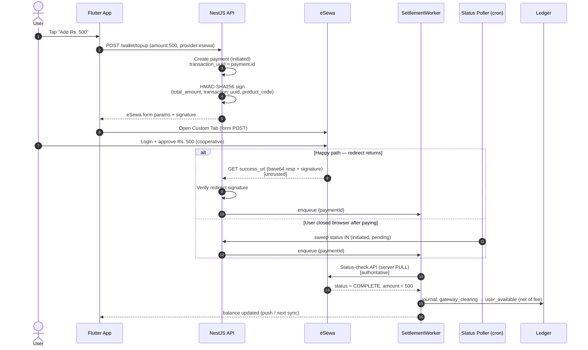
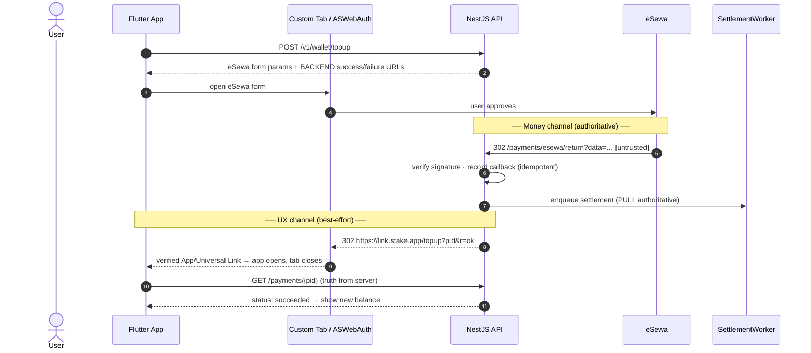

# Phase 2 — Payment System & Architecture Analysis
### Commitment-Based Digital Discipline App ("Stake")

## Provider landscape & what it forces on the design

| Provider | Type | Integration reality | Off-session charge? |
|---|---|---|---|
| **eSewa** (Nepal) | Wallet/redirect | Redirect + signed callback (HMAC). No card vaulting. | ❌ |
| **Khalti** (Nepal) | Wallet/redirect + KPG | Redirect/SDK + server verification (`lookup`/verify). | ❌ |
| **Fonepay** (Nepal) | QR / inter-bank | QR + webhook. | ❌ |
| **Stripe** (Global) | Card/processor | PaymentIntents, **SetupIntents + off-session charging**, Connect for payouts. | ✅ |
| **Apple Pay / Google Pay** | Wallet front-ends | Ride on Stripe as a payment method; store-policy nuance for digital goods. | ✅ via Stripe (on-session) |

**Decisive fact:** the Nepali providers are **redirect-and-approve only**. None let you silently
charge a saved instrument. This **kills any model that charges the user *at the moment they cheat***
in the local market — at that moment the user is hostile and won't complete a redirect.
**Capture money *before* the violation, while the user is cooperative.**

## The three patterns

### Option A — Immediate payment per violation/unlock
- **Pros:** no stored value; no pre-commitment friction; 1:1 event mapping.
- **Cons (severe):** every enforcement moment = full redirect/3DS round-trip → **abysmal success rate**; **impossible for penalties** (can't charge after revoke/uninstall); broken-feeling latency; tiny Rs.50 charges are margin-negative.
- **Verdict:** ❌ Disqualified as primary.

### Option B — Wallet (preload, auto-deduct)
- **Pros:** enforcement is a **local ledger debit** → instant, works offline-then-sync, **works for penalties after revoke/uninstall**; top-ups happen when cooperative → high gateway success; amortizes fees.
- **Cons:** **stored value** → financial regulation, refunds, escrow; requires a real **double-entry ledger**.
- **Verdict:** ✅ Strong. Weaker on pre-commitment psychology.

### Option C — Commitment Deposit (lock upfront, penalties eat deposit)
- **Pros:** **strongest behavioral enforcement** (loss-aversion on already-surrendered money); funds captured up front; "win your money back" loop drives retention.
- **Cons:** **highest signup friction**; refund/return flows clunky on Nepali rails; legal clarity needed.
- **Verdict:** ✅ Best psychology, worst onboarding friction. Don't make it the only door.

## Definitive recommendation — Hybrid: Wallet substrate + Commitment Deposit as a wallet "lock"

Build **one ledger (Option B)** and implement **Option C as a *hold/lock* on wallet funds**:


**Why it wins:**
- **Lowest friction:** only *top-ups* touch a gateway, infrequent & voluntary → never fighting a redirect at the moment of weakness.
- **Highest success rate:** gateway interactions happen during cooperative, batched top-ups; enforcement debits never touch the gateway → effectively 100% "success."
- **Best psychology:** the *locked* portion delivers Option C's loss-aversion; wallet substrate keeps plumbing unified; "stake more for a stronger commitment" becomes a feature.

**Concrete rules:**
- **Provider routing:** Nepal → eSewa/Khalti/Fonepay; international cards/Apple/Google Pay → Stripe. One internal `payment_provider` abstraction; providers interchangeable.
- **Forfeited money** routes to a **system "forfeit" ledger account** (revenue vs. charity — Phase 1 decision).
- **Returned (un-forfeited) deposit** goes back to *available balance*, **not** auto-refunded to card (local-rail refunds are painful/lossy) — offer explicit withdrawal instead.
- **Store policy:** unlocks/penalties are arguably digital goods → check Apple/Google billing rules; top-up provider stays behind the abstraction so it's swappable (may be forced to IAP on iOS).

## eSewa top-up flow (redirect + status-pull)

eSewa is touched **only** during a cooperative wallet top-up — never at enforcement time.
Unlike Stripe, **eSewa ePay v2 has no asynchronous server-to-server webhook**: confirmation
arrives via a browser **redirect** to `success_url`, which is **user-controllable and therefore
untrusted**. The authoritative confirmation is always a **server-side status-check API pull**
(the `fetchStatus` step in the Settlement Worker). Two rules fall out of this:

- **`success_url` points at the backend, not the app** — the server verifies before deep-linking
  the user home, so a hostile user never controls the confirmation path.
- **A status poller is mandatory** — if the user pays then closes the browser before the redirect
  fires, the redirect path never runs. A cron sweep over `payments WHERE status IN
  ('initiated','pending')` (backed by `idx_payments_status`) pulls eSewa status and settles late.



## Deep-link / `success_url` routing

**Governing principle — two independent channels.** The deep link back into the app is *not* how money
is credited; it is purely UX. These never depend on each other:

| Channel | Path | Trust | If it fails |
|---|---|---|---|
| **Money** (authoritative) | eSewa → backend callback → SettlementWorker pull → ledger | server-authoritative | poller + R4 settle it anyway (see ledger-workers §6b) |
| **UX** (best-effort) | backend → deep link → app "confirming…" screen | untrusted, cosmetic | app re-fetches `GET /payments/{id}`; user still gets the push receipt |

So `success_url` **must** be a backend URL, never the app directly — that guarantees the signed eSewa
callback is received and verified server-side even if the app-return never fires. The app **never** reads
money state from deep-link params; it always re-fetches from the server (device is untrusted).

**Routing chain:**
```
1. App   → POST /v1/wallet/topup            backend creates payment (transaction_uuid = payment.id),
                                             returns eSewa form params + BACKEND success/failure URLs
2. App   opens eSewa form (Custom Tab / ASWebAuthenticationSession)
3. User  approves at eSewa
4. eSewa → 302  https://api.stake.app/v1/payments/esewa/return?data=<b64>
           backend: verify signature → record callback (idempotent inbox)
                    → enqueue q.settlement{paymentId}   (PULL is authoritative — NOT this payload)
                    → 302 to the app deep link
5. link  https://link.stake.app/topup?pid=<id>&r=ok    OS routes to app (verified link); tab closes
6. App   "Confirming your top-up…" → GET /payments/{pid} until succeeded (also receives push receipt)
```

| Backend endpoint | eSewa appends | Then |
|---|---|---|
| `GET /v1/payments/esewa/return` | `?data=<b64>` | verify sig → enqueue settlement → 302 `…/topup?pid=&r=ok` |
| `GET /v1/payments/esewa/cancel` | — | mark intent abandoned → 302 `…/topup?pid=&r=cancel` |

The return handler **does not credit** from the redirect payload — crediting is the SettlementWorker's
authoritative status pull. A forged or replayed `data` therefore cannot move money.

**🔒 Locked decision — verified App Links / Universal Links, no custom URL scheme.** The return uses an
`https://` link on an owned domain (`link.stake.app`), proven via `assetlinks.json` (Android) /
`apple-app-site-association` (iOS), so the OS cryptographically confirms app ownership and **no other app
can intercept the redirect**. Custom schemes (`stakeapp://`) are rejected: any app can register the same
scheme and hijack the callback. Defense-in-depth: the app treats link params as routing hints only.

- **Android (MVP):** Chrome **Custom Tabs** opens eSewa; the backend 302 to the verified **App Link**
  launches the app and dismisses the tab. Flutter: `flutter_custom_tabs`/`url_launcher` to open,
  `app_links` to receive (warm-resume **and** cold-start).
- **iOS (fast-follow):** **`ASWebAuthenticationSession`** — purpose-built for "open web flow, return via
  callback"; auto-dismisses the sheet and hands the callback URL to the completion handler (https callback
  on iOS 17.4+).

**Edge cases — all degrade to reconciliation:**

| Case | Handling |
|---|---|
| User closes the tab (no redirect) | App **must not assume cancelled** → `GET /payments/{pid}`; may be the "paid-but-didn't-return" case → §6b poller settles |
| App killed during payment | Deep link **cold-starts** app; `app_links` initial-link handler routes to the confirm screen by `pid` |
| Deep link fails entirely | Backend already has the callback; poller/R4 settle; user sees balance + push next open |
| Lands in browser, not app | Backend return page renders an HTML "Open the Stake app" fallback, not a dead link |
| Duplicate / replayed return URL | Callback inbox is idempotent; settlement no-ops if already terminal |
| Concurrent top-ups | `pid` disambiguates; each tab session is bound to one `pid` |



> **iOS synergy:** an extension cannot present a payment sheet, so on iOS "pay to unlock" is done
> as **pre-authorized unlocks** — the user buys unlock credit/time *in the app* (cooperative,
> gateway-friendly) and the `ShieldAction` extension just verifies & consumes a token from the
> App Group. The wallet model maps cleanly onto this constraint.
