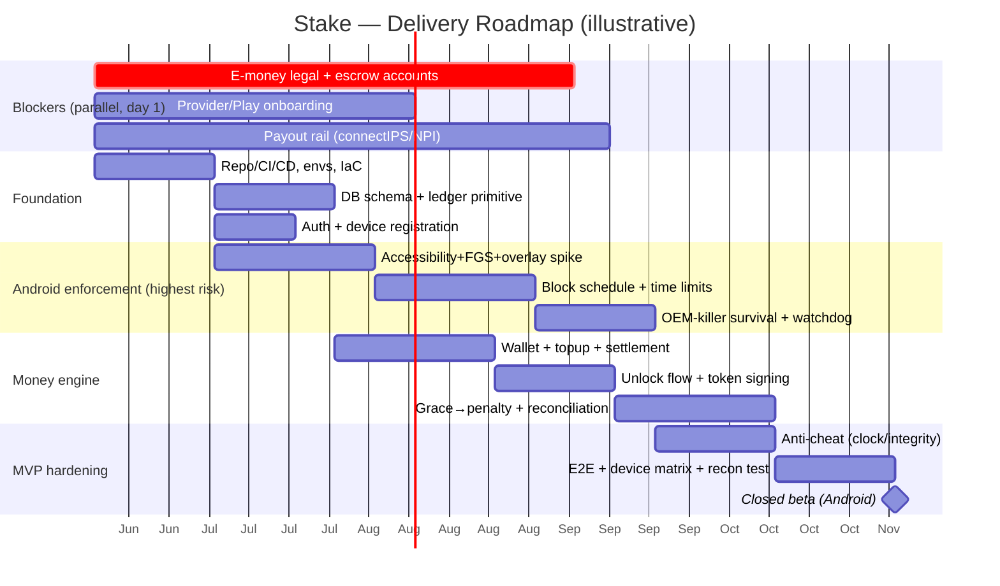
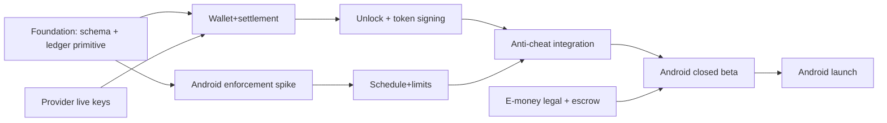

# Phase 5 — Project Plan & Delivery Cutline
### Commitment-Based Digital Discipline App ("Stake")

> 🎯 **Scope: Android-only.** iOS is **deferred** (fast-follow after the Android launch). iOS rows below are
> retained as deferred reference and struck from the active plan, team, and timeline.

Organizing principle: **the e-money legal review has a long lead time and can kill the launch — start it on
day one, in parallel with everything else.** The product is **Android-only** for now (richest enforcement +
custom pay screen).

> Dates are illustrative, anchored to a ~mid-2026 start; treat the **sequence and durations** as the commitment.

## 1. The Launch Blocker — Start Now (Week 0)
| Blocker | Why critical | Week-0 action | Owner |
|---|---|---|---|
| **Stored-value / e-money legal review** | Wallet holds user funds → financial regulation, **segregated/escrow account**, KYC; **forfeit→revenue decided — counsel must confirm it's not gambling** | Engage Nepal fintech counsel + global-payments view; **validate revenue-forfeit (commitment-contract, not gambling)**; open settlement accounts | Founder/PM + Legal |

*(Deferred with iOS — **Apple Family Controls entitlement**: without `com.apple.developer.family-controls` the iOS module is unshippable, and Apple gates & can deny it. Re-activate and submit early the moment iOS resumes.)*

**Also Week 0 (lead-time):** payment provider onboarding (eSewa/Khalti/Fonepay KYC + Stripe); **payout/
disbursement rail onboarding — connectIPS/NPI agreement (NCHL) or a bulk-disbursement deal** (collection
gateways can't pay users out; contracts + NRB-regulated onboarding are slow — *not a hard blocker because
MVP withdrawals run on manual batch bank transfer*); Play Console + App Store accounts; Google's
Accessibility/`PACKAGE_USAGE_STATS` declared-use review prep.

If the blocker slips, narrow further (defer the staked-deposit lock, ship the simplest wallet-funded MVP). iOS + staked-deposit are already fast-follows.

## 2. Team Shape
| Role | Count | Focus |
|---|---|---|
| Product/PM | 1 | Scope, blockers, provider/legal coordination, metrics |
| **Android engineer (native-strong)** | 1–2 | Accessibility/FGS/overlay, OEM-killer survival — *highest-risk seat* |
| ~~iOS engineer (native-strong)~~ | — | *Deferred with iOS — not staffed for the Android-only scope; add when iOS resumes.* |
| Flutter engineer | 1 | Shell UI, facade, account/wallet/schedule screens |
| Backend engineer | 1–2 | NestJS API, **ledger/workers** — *second-highest-risk seat* |
| DevOps/SRE (fractional early) | 0.5–1 | K8s, DB/PITR, observability, key mgmt |
| QA | 1 | Device matrix, money e2e, reconciliation tests |
| Design (fractional) | 0.5 | Block screens, break/forfeit moments |

## 3. Roadmap

**Milestones / gates:**
- **M1 Foundation:** CI/CD, schema, ledger primitive, auth, device registration. *Gate: reconciliation test passes on a toy ledger.*
- **M2 Android enforcement spike:** block <300 ms on real launch, survives force-stop on an aggressive OEM skin. *(biggest de-risk — front-load it.)*
- **M3 Money vertical slice:** top-up → credit → paid unlock w/ signed token → ledger balances. *Gate: R1–R3 clean.*
- **M4 Anti-cheat in:** clock-tamper + attestation + grace→penalty end-to-end. *Gate: forfeit lands on simulated uninstall/silence.*
- **M5 Android closed beta:** real users, real small money. *Gate: legal sign-off on stored value live.*
- **M6 Android public launch.**
- *(Deferred) **M7 iOS beta** (entitlement-gated) · **M8 iOS launch + scale** — fast-follow after M6.*

## 4. MVP Cutline (Android-only)
**IN:** Android only · restricted apps + recurring schedules (FR-1) · per-app daily limits + asymmetric edits
(FR-3/4) · block screen + paid **5-min unlock** from wallet (FR-2) · commitment-break fee (FR-4/5) · **wallet
(preload + auto-deduct)** + one local provider + Stripe · anti-cheat (clock-monotonic, Play Integrity,
heartbeat + silence-sweeper, grace→penalty) · double-entry ledger + nightly reconciliation · basic streaks + snapshot.

**IN (withdrawals):** KYC-gated **manual-batch** payout (two-phase hold, gross-down fee, double-pay guard, R5 recon).

**OUT (fast-follows):** **iOS (deferred — fast-follow after Android launch)** · **staked commitment-deposit lock** (ship wallet first, add
the lock once proven — it's incremental on the same ledger) · **automated payout rail (connectIPS/NPI)** +
multiple unlock tiers, charity-forfeit, withdrawals polish · clone detection, Device Admin anti-uninstall,
multi-device · rich analytics, social features.

## 5. Critical-Path Dependencies

**Most likely to set the date:** (1) the Android enforcement spike (prototype OEM-killer survival in Sprint 1);
(2) legal/e-money sign-off (gates beta-with-real-money regardless of code).

## 6. Risk Register
| Risk | Likelihood | Impact | Mitigation |
|---|---|---|---|
| *(Deferred w/ iOS) Apple denies entitlement* | — | — | only relevant when iOS resumes; Android-only is the current scope |
| E-money regulation heavier than expected | Med | High | legal Week 0; segregated accounts; charity-forfeit fallback |
| Revenue-forfeit ruled gambling / impermissible | Med | High | legal validates Week 0; **`system_charity` fallback is a config switch** (ledger supports both) |
| Over-reliance on penalty revenue (profiting from user failure) | Med | Med | track **% revenue from penalties vs subscription** (§8); product-health guardrail, not a growth metric |
| OEM battery-killers defeat enforcement | High | Med | Sprint-1 spike; watchdog + boot receiver; **silence→forfeit backstop** |
| Play rejects Accessibility | Med | Med | declared-use justification; UsageStats-only fallback |
| Small-txn fees crush margin | Med | Med | wallet batches top-ups; min top-up sizing; fee SLI |
| Payout rail onboarding slow (connectIPS/NPI) | Med | Med | **manual batch bank transfer at MVP**; start agreement Week 0; KYC-gated, two-phase hold |
| Duplicate/fraudulent payout (real money lost) | Low | Critical | idempotent disburse ref (UNIQUE); never blind-retry stuck payouts; R5 recon; KYC + bank-name match |
| Deposit "pay before value" churn | Med | Med | MVP uses wallet; add deposit after retention data |
| Ledger bug moves money wrong | Low | Critical | single posting primitive; exactly-once; nightly R1–R3; auto-freeze; restore drills |
| False penalties (our outage) | Med | High | grace windows; `PENALTY_CONVERSION_PAUSED`; never penalize on our own outage |

## 7. Launch Gates (Ready to Ship Real Money)
- [ ] Legal sign-off: stored value + e-money + **revenue-forfeit confirmed legally clean (not gambling)**; segregated account live; ledger wired to `system_forfeit_revenue`.
- [ ] ≥1 local provider + Stripe in **production** with verified webhooks (raw-body sig + server-pull confirm).
- [ ] Reconciliation R1–R4 green in prod; **auto-freeze** wired + tested.
- [ ] Withdrawal path live: KYC-gated manual-batch payout, two-phase hold, **R5 payout recon** + double-pay guard tested.
- [ ] PITR restore drill passed with post-restore reconciliation.
- [ ] Ed25519 key in KMS; client pins current+next; rotation runbook tested.
- [ ] Enforcement verified on device matrix (Pixel + Samsung + Xiaomi/Oppo) incl. force-stop/reboot/clock-rollback.
- [ ] Play Integrity verified server-side; grace→forfeit lands on simulated uninstall/silence.
- [ ] Onboarding gets a real user through all Android permissions with verification.
- [ ] Privacy policy + honest "we detect & charge, we don't physically prevent" framing in-app + store listing.

## 8. Validate-Before-You-Scale (Android beta)
- **Behavioral:** median days a commitment survives; bypass-attempt rate; reduction in restricted-app minutes vs baseline.
- **Financial:** payment success rate; fee-as-%-of-volume; **% revenue from penalties vs subscription** (over-reliance = product failing users).
- **Reliability:** zero reconciliation drift; enforcement-uptime per device; false-penalty rate ≈ 0.
- **Retention:** D7/D30; do users who *stake more* retain better (justifies pushing the deposit feature)?

Green → fund iOS + staked deposits + growth. Red → fix the model before scaling cost.

## 9. Sequencing Summary
1. **Week 0:** fire the e-money legal blocker + provider/Play onboarding + **payout-rail (connectIPS/NPI) onboarding** (long poles).
2. **Sprints 0–2:** foundation (CI, schema, ledger primitive, auth) **and** Android enforcement spike in parallel.
3. **Sprints 3–6:** money vertical slice + Android schedules/limits + OEM survival.
4. **Sprints 7–8:** anti-cheat integration, E2E + device matrix, **Android closed beta** (gated on legal).
5. **Android public launch**, measure the thesis.
6. *(Deferred) **iOS fast-follow*** (entitlement-gated, pre-auth-unlock model) — revisit post-launch; meanwhile add **staked deposits**, then scale.
